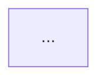
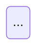
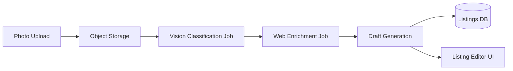
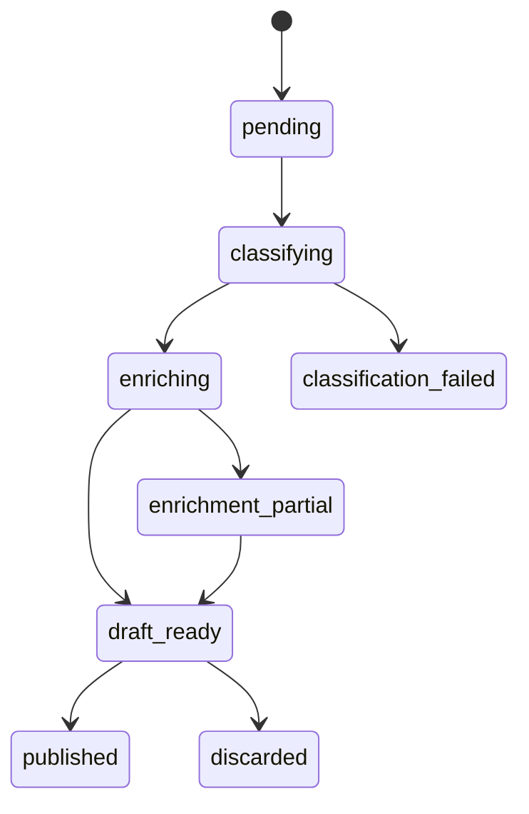

# /plan-eng-review — エンジニアリングアーキテクチャゲート

方向性決定後、実装前のコマンド。検証済みのプロダクト方向性を受け取り、図付きの構築可能な技術仕様を返します。実装コードが1行も書かれる前に、システムにアーキテクチャを考え抜かせます。

**`/plan-ceo-review` で方向性が固定された後に使用します。まだプランモード。**


## このコマンドが解決する問題

プロダクトの方向性が固定されると、次の失敗モードは曖昧なアーキテクチャです。「システムが処理する」は計画ではありません。このコマンドは、本番インシデントになる前に、難しい技術的質問に対する明示的な回答を強制します。

重要な解放: **図の生成を強制すること**。図は散文が曖昧にしておく暗黙の前提を明らかにします。シーケンス図は誰が何を呼び出すかを指定させます。ステートマシンはすべての失敗モードを明示的に列挙させます。


## 使用するタイミング

- プロダクトの方向性が検証された後（`/plan-ceo-review` またはそれと同等のものの後）
- 非自明な機能の実装作業が始まる前
- 機能に非同期コンポーネント、外部依存関係、またはマルチステップフローがある場合
- 「アーキテクチャは明確」が前提でなく証明が必要な場合


## 生成すべき成果物

| 成果物 | 重要な理由 |
|--------|----------------|
| アーキテクチャ図（Mermaid） | コンポーネント境界を明確にする |
| データフロー図 | データがどこで変換され、誰が所有するかを示す |
| コアフローのステートマシン | 失敗を含むすべての状態の列挙を強制する |
| 同期 vs 非同期の境界決定 | 根拠なしの「非同期にすればよい」を防ぐ |
| 失敗モードのインベントリ | ハッピーパスだけでなく、すべての失敗パス |
| 信頼境界マップ | 外部入力をどこで受け入れるか？何を検証するか？ |
| テストマトリクス | 何をどのレイヤーでテストする必要があるか |


## プロンプトテンプレート

```markdown
# /plan-eng-review

あなたはエンジニアリングマネージャー/テックリードモードにいます。方向性は固定されています。
構築可能にすること — プロダクトの方向性を、エンジニアが実装中に
アーキテクチャの意思決定を行わずに実装できる技術仕様に変換することがあなたの仕事です。

プロダクトの方向性に疑問を持たない。スコープの変更を提案しない。
何も実装しない。技術仕様を返す。

## ステップ 1: 機能の再述

1-2文: 何を構築するか。正しいブリーフで作業していることを確認する。

## ステップ 2: アーキテクチャ図

Mermaid でコンポーネントアーキテクチャを描く:
- 関係するすべてのコンポーネント（フロントエンド、バックエンド、ジョブ、ストレージ、外部 API）
- コンポーネント間の境界
- データフローの方向



## ステップ 3: コアフロー — シーケンス図

ハッピーパスをシーケンス図として描く:
- どのコンポーネントがどの順序でどれを呼び出すか
- 各ステップで渡されるデータ
- 非同期ハンドオフの場所

```mermaid
sequenceDiagram
    ...
```

## ステップ 4: ステートマシン

コアドメインオブジェクトのステートマシンを描く:
- すべての有効な状態
- すべての遷移とそのトリガー
- 終端状態（成功と失敗）



## ステップ 5: 同期 vs 非同期の決定

フロー内の各操作について:
- **同期**（リクエストをブロック）: なぜか、レイテンシバジェットは何か
- **非同期**（バックグラウンドジョブ）: なぜか、何がリトライをトリガーするか、
  呼び出し元はどのように成功を知るか

## ステップ 6: 失敗モードのインベントリ

フロー内の各ステップについて列挙する:
- 何が失敗しうるか
- どのように失敗するか（サイレント？大きく？部分的成功？）
- 復旧パスは何か
- ユーザーには何が表示されるか

現在サイレントな失敗をフラグする。

## ステップ 7: 信頼境界

各外部入力（ユーザーアップロード、API レスポンス、Webhook ペイロード）について:
- 何を信頼するか？何を検証するか？
- 悪意ある入力はどこで害を与えられるか？
- 外部データがさらなる処理に流れているか（プロンプトインジェクションのリスク）？

## ステップ 8: テストマトリクス

| レイヤー | テストする内容 | 理由 |
|-------|-------------|-----|
| ユニット | ... | ... |
| 統合 | ... | ... |
| E2E | ... | ... |

ステップ 6 の失敗モードのうち、対応するテストがないものを特定する。

## ステップ 9: 未解決の質問

実装開始前に人間の決定が本当に必要なアーキテクチャ的な意思決定をリストアップする。
包括的なリストではなく — ブロッカーのみ。
```


## 例

**機能**: 写真からのスマートリスティング作成（`/plan-ceo-review` 後）

**出力抜粋**:


ステートマシン:


失敗モード:
- 分類失敗 → 手動リスティングにデグレード（サイレント失敗ではない）
- エンリッチメントが部分的に失敗 → 成功したものを使用し、欠けているフィールドをフラグ
- アップロード成功、分類ジョブが開始しない → 孤立したファイル、クリーンアップジョブが必要
- ドラフト生成での Web データ → プロンプトインジェクションのベクター、LLM に渡す前にサニタイズ


## 他のコマンドとの統合

```
/plan-ceo-review    → プロダクトの方向性を固定
/plan-eng-review    → アーキテクチャを固定  ← ここにいます
[実装]
/review             → 慎重なマージ前チェック
/ship               → リリース
```

## 参照

- [コグニティブモード切替](../../guide/workflows/gstack-workflow.md) — 完全なワークフローコンテキスト
- [plan-ceo-review](./plan-ceo-review.md) — 前のステップ
- [プランパイプライン](../../guide/workflows/plan-pipeline.md) — ADR メモリを使った自動化オーケストレーション
