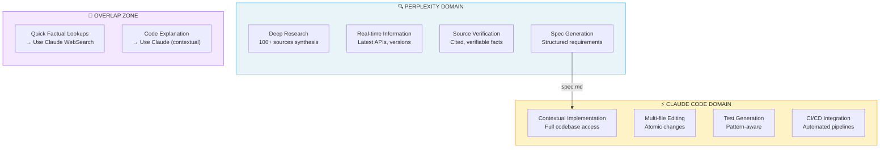
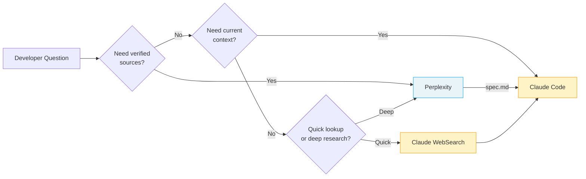

# AIエコシステム：補完ツールでClaude Codeを最大化する

> **読了時間**: 約25分
>
> **目的**: このガイドでは、Claude Codeと補完AIツールをいつ使い分けるか、そして最適なワークフローのためにどうチェーンするかを解説します。


## 目次

- [はじめに](#はじめに)
- [1. Perplexity AI（リサーチ・情報収集）](#1-perplexity-aiリサーチ情報収集)
- [2. Google Gemini（ビジュアル理解）](#2-google-geminビジュアル理解)
- [3. Kimi（PPTX・長文ドキュメント生成）](#3-kimipptx長文ドキュメント生成)
- [4. NotebookLM（情報統合・音声）](#4-notebooklm情報統合音声)
- [5. 音声入力ツール（Wispr Flow、Superwhisper）](#5-音声入力ツールwispr-flowsuperwhisper)
- [6. IDEベースのツール（Cursor、Windsurf、Cline）](#6-ideベースのツールcursorwindsurfcline)
- [6.1 Google Antigravity（エージェントファーストIDE）](#61-google-antigravityエージェントファーストide)
- [7. UIプロトタイパー（v0、Bolt、Lovable）](#7-uiプロトタイパーv0boltlovable)
- [8. ワークフローオーケストレーション](#8-ワークフローオーケストレーション)
- [9. コスト・サブスクリプション戦略](#9-コストサブスクリプション戦略)
- [10. Claude Cowork（リサーチプレビュー）](#10-claude-coworkリサーチプレビュー)
- [11. AIコーディングエージェントマトリックス](#11-aiコーディングエージェントマトリックス)
- [11.1 Goose：オープンソースの代替（Block）](#111-gooseオープンソースの代替block)
- [11.2 実践者の洞察](#112-実践者の洞察)
- [11.3 構築するかツールを使うかの判断基準](#113-構築するかツールを使うかの判断基準)
- [11.4 Skills配布プラットフォーム](#114-skills配布プラットフォーム)
- [12. コンテキストパッキングツール](#12-コンテキストパッキングツール)
- [付録：すぐに使えるプロンプト](#付録すぐに使えるプロンプト)
- [代替プロバイダー（コミュニティの回避策）](#代替プロバイダーコミュニティの回避策)


## はじめに

### 哲学：置き換えではなく、拡張

Claude Codeが得意とすること：
- **コードベース全体にわたるコンテキスト推論**
- **テスト統合を伴うマルチファイル実装**
- **CLAUDE.mdファイルによる永続的なメモリ**
- **CI/CDパイプラインのCLI自動化**
- **最小限の監督によるエージェント的なタスク完了**

Claude Codeが（設計上）苦手とすること：
- **ソース検証を伴うリアルタイムWeb検索**（WebSearchは存在するが限定的）
- **画像生成**（ネイティブ機能なし）
- **PowerPoint/スライド生成**（PPTX出力なし）
- **音声合成**（TTS機能なし）
- **ブラウザベースのプロトタイピング**（ビジュアルプレビューなし）

目標は「より優れた」ツールを探すことではなく、**各ステップに適切なツールをチェーンする**ことです。

### 補完性マトリックス

| タスク | Claude Code | より優れた代替手段 | 理由 |
|------|-------------|-------------------|-----|
| **コード実装** | ✅ 最良 | - | コンテキスト推論＋ファイル編集 |
| **ソース付きの深いリサーチ** | ⚠️ 限定的 | Perplexity Pro | 100件以上の検証済みソース |
| **画像→コード** | ⚠️ 限定的 | Gemini 2.5+ | 優れたビジュアル理解 |
| **スライド生成** | ❌ なし | Kimi.com | ネイティブPPTXエクスポート |
| **音声概要** | ❌ なし | NotebookLM | ポッドキャスト形式の統合 |
| **ブラウザプロトタイピング** | ❌ なし | v0.dev、Bolt | ライブプレビュー |
| **IDEオートコンプリート** | ❌ なし | Copilot、Cursor | インライン候補提示 |


## 1. Perplexity AI（リサーチ・情報収集）

### 補完性ダイアグラム

以下のダイアグラムは、開発ワークフロー全体でPerplexityとClaude Codeがどのように互いを補完するかを示しています：



**重要なポイント**: Perplexityは「何を構築すべきか？」に答え、Claude Codeは「ここでどう構築するか？」に答える。

### 判断フロー



### ClaudeよりPerplexityを使うべき場面

| シナリオ | Perplexityを使用 | Claudeを使用 |
|----------|---------------|------------|
| 「Xの最新APIは？」 | ✅ | ⚠️ 知識カットオフあり |
| 「認証用ライブラリ5つを比較して」 | ✅ ソース付き | ⚠️ ハルシネーションの可能性 |
| 「このエラーメッセージを説明して」 | ⚠️ 一般的な回答 | ✅ コンテキスト依存 |
| 「私のコードベースに認証を実装して」 | ❌ ファイルなし | ✅ フルアクセス |

### 開発者向けPerplexity Pro機能

**Deep Researchモード**
- 100件以上のソースを構造化された出力に統合
- 3〜5分かかるが、包括的な仕様を生成
- Markdownとしてエクスポート → Claude Codeに入力

**モデル選択**
- Claude Sonnet 4：技術的な文章やドキュメントに最適
- GPT-4o：コードスニペットに適している
- Sonar Pro：迅速な事実確認に最適

**Labsの機能**
- Spaces：永続的なプロジェクトコンテキスト
- Code blocks：シンタックスハイライト付きのエクスポート
- Charts：データからの自動生成

### 統合ワークフロー

#### パターン1：リサーチ → 仕様 → コード

```
┌─────────────────────────────────────────────────────────┐
│ 1. PERPLEXITY (Deep Research)                           │
│    "Research best practices for JWT refresh tokens      │
│     in Next.js 15. Include security considerations,     │
│     common pitfalls, and library recommendations."      │
│                                                         │
│    → Output: 2000-word spec with sources               │
└───────────────────────────┬─────────────────────────────┘
                            ↓ Export as spec.md
┌─────────────────────────────────────────────────────────┐
│ 2. CLAUDE CODE                                          │
│    > claude                                             │
│    "Implement JWT refresh tokens following spec.md.     │
│     Use the jose library as recommended."               │
│                                                         │
│    → Output: Working implementation with tests         │
└─────────────────────────────────────────────────────────┘
```

#### パターン2：並列ペインワークフロー

tmuxまたはターミナル分割を使用：

```bash
# Left pane: Perplexity (browser or CLI)
perplexity "Best practices for rate limiting in Express"

# Right pane: Claude Code (implementing)
claude "Add rate limiting to API. Check spec.md for approach."
```

### 比較：Claude WebSearch対Perplexity

| 機能 | Claude WebSearch | Perplexity Pro |
|---------|-----------------|----------------|
| ソース数 | 約5〜10件 | 100件以上（Deep Research） |
| ソース検証 | 基本的なもの | 完全な引用 |
| リアルタイムデータ | あり | あり |
| エクスポート形式 | コンテキスト内のテキスト | Markdown、コードブロック |
| 最適な用途 | 簡単な事実確認 | 包括的なリサーチ |
| コスト | 含まれている | 月額$20（Pro） |

**推奨**: 簡単な事実確認にはClaude WebSearchを使用する。エコシステムの理解が必要な重要な実装の前には、Perplexity Deep Researchを使用する。


## 2. Google Gemini（ビジュアル理解）

### 開発者向けユースケース

**Geminiのビジュアル超能力**：
- UIモックアップ → HTML/CSS/Reactコード（90%以上の再現度）
- ダイアグラム解釈（フローチャート → Mermaid/コード）
- スクリーンショットのデバッグ（「なぜこう見えるのか？」）
- デザイントークンの抽出（画像からの色、スペーシング）

### 開発向けGemini 2.5 Pro

以下の分野でクラス最高：
- **複雑なUI変換**：FigmaのスクリーンショットをアップロードしてTailwindコンポーネントを取得
- **ダイアグラム理解**：アーキテクチャダイアグラム → 実装計画
- **エラー分析**：エラーのスクリーンショットをアップロードしてデバッグ手順を取得

モデル選択：
- **Gemini 2.5 Pro**：複雑なビジュアル推論、長いコンテキスト
- **Gemini 2.5 Flash**：簡単なビジュアルタスク、低コスト

### 統合ワークフロー

#### パターン：ビジュアル → コード

```
┌─────────────────────────────────────────────────────────┐
│ 1. GEMINI 2.5 PRO                                       │
│    Upload: screenshot.png of Figma design               │
│    Prompt: "Convert this to a React component using     │
│            Tailwind CSS. Use semantic HTML and          │
│            include responsive breakpoints."             │
│                                                         │
│    → Output: JSX + Tailwind code                       │
└───────────────────────────┬─────────────────────────────┘
                            ↓ Copy to clipboard
┌─────────────────────────────────────────────────────────┐
│ 2. CLAUDE CODE                                          │
│    > claude                                             │
│    "Refine this component for our Next.js project.      │
│     Add proper TypeScript types, our Button component,  │
│     and connect to the auth context."                   │
│                                                         │
│    → Output: Production-ready component                │
└─────────────────────────────────────────────────────────┘
```

#### パターン：ダイアグラム → 実装計画

```
┌─────────────────────────────────────────────────────────┐
│ 1. GEMINI                                               │
│    Upload: architecture-diagram.png                     │
│    Prompt: "Analyze this architecture diagram.          │
│            Output a Mermaid diagram with the same       │
│            structure, and list the components."         │
│                                                         │
│    → Output: Mermaid code + component list             │
└───────────────────────────┬─────────────────────────────┘
                            ↓ Paste mermaid to CLAUDE.md
┌─────────────────────────────────────────────────────────┐
│ 2. CLAUDE CODE                                          │
│    "Implement the UserService component from the        │
│     architecture in CLAUDE.md. Start with the           │
│     interface, then the implementation."                │
│                                                         │
│    → Output: Implemented service                       │
└─────────────────────────────────────────────────────────┘
```

### 画像生成の代替手段

ダイアグラム、モックアップ、ビジュアルアセットの生成に：

| ツール | 最適な用途 | 形式 | 品質 |
|------|----------|--------|---------|
| Ideogram 3.0 | UIモックアップ、アイコン | PNG、SVG | 高い |
| Recraft v3 | ベクター、ロゴ | SVG、PNG | 非常に高い |
| Midjourney | アーティスティックなビジュアル | PNG | アーティスティック |
| DALL-E 3 | 素早いコンセプト | PNG | 良い |

**生成画像のワークフロー**：
1. 好みのツールで画像を生成
2. Geminiにアップロードしてコードに変換
3. Claude Codeで洗練させる


## 3. Kimi（PPTX・長文ドキュメント生成）

### Kimiとは？

[Kimi](https://kimi.ai)はMoonshot AIのアシスタントで、以下の点で注目されています：
- **ネイティブPPTX生成**（Markdownではなく実際のスライド）
- **128K以上のトークンコンテキスト**（コードベース全体）
- **コードを意識したレイアウト**（スライド内のシンタックスハイライト）
- **多言語対応**（中国語/英語に優れている）

### 開発者向けユースケース

**プレゼンテーション生成**：
- PRサマリー → ステークホルダー向けデッキ
- アーキテクチャドキュメント → ビジュアルプレゼンテーション
- 技術仕様 → チームオンボーディングスライド
- コードウォークスルー → トレーニング資料

### 統合ワークフロー

#### パターン：コード → プレゼンテーション

```
┌─────────────────────────────────────────────────────────┐
│ 1. CLAUDE CODE                                          │
│    "Generate a summary of all changes in the last       │
│     5 commits. Format as markdown with sections:        │
│     Overview, Key Changes, Breaking Changes, Migration."│
│                                                         │
│    → Output: changes-summary.md                        │
└───────────────────────────┬─────────────────────────────┘
                            ↓ Upload to Kimi
┌─────────────────────────────────────────────────────────┐
│ 2. KIMI                                                 │
│    Prompt: "Create a 10-slide presentation from this    │
│            summary for non-technical stakeholders.      │
│            Use business-friendly language.              │
│            Include one slide per major feature."        │
│                                                         │
│    → Output: stakeholder-update.pptx                   │
└─────────────────────────────────────────────────────────┘
```

#### パターン：アーキテクチャ → トレーニング

```
┌─────────────────────────────────────────────────────────┐
│ 1. CLAUDE CODE (using /explain or equivalent)           │
│    "Explain the authentication flow in this project.    │
│     Include sequence diagrams (mermaid) and key files." │
│                                                         │
│    → Output: auth-explanation.md with diagrams         │
└───────────────────────────┬─────────────────────────────┘
                            ↓ Upload to Kimi
┌─────────────────────────────────────────────────────────┐
│ 2. KIMI                                                 │
│    "Create an onboarding presentation for new devs.     │
│     20 slides covering the auth system. Include         │
│     code snippets and diagrams where relevant."         │
│                                                         │
│    → Output: auth-onboarding.pptx                      │
└─────────────────────────────────────────────────────────┘
```

### 比較：プレゼンテーションツール

| ツール | 強み | 弱み | 最適な用途 |
|------|-----------|------------|----------|
| **Kimi** | ネイティブPPTX、コード対応 | デザインの洗練度が低い | 技術的なデッキ |
| **Gamma.app** | 美しいテンプレート | コードサポートが少ない | ビジネスデッキ |
| **Tome** | AIネイティブ、ビジュアル | 高価 | マーケティング |
| **Beautiful.ai** | スマートテンプレート | 手動操作が多い | デザイン重視 |
| **Marp** | Markdown → スライド | 手動スタイリング | 開発者デッキ |

**推奨**: コードを含む技術コンテンツにはKimiを使用する。ビジネス/投資家向けデッキにはGammaを使用する。


## 4. NotebookLM（情報統合・音声）

### 開発者向けユースケース

**ドキュメント統合**：
- 50件以上のファイルをアップロード → 統一された理解を取得
- コードベースについて質問する
- 通勤学習のための音声概要を生成する

**音声概要機能**：
- アップロードされたコンテンツから10〜15分の「ポッドキャスト」を生成
- 2人のAIホストがドキュメントについて議論する
- オンボーディングや大規模システムのレビューに最適

### 統合ワークフロー

#### パターン：コードベース → 音声オンボーディング

```
┌─────────────────────────────────────────────────────────┐
│ 1. EXPORT (via Claude Code or manual)                   │
│    "Export all markdown files from docs/ and the        │
│     main README to a single combined-docs.md file."     │
│                                                         │
│    → Output: combined-docs.md (50K tokens)             │
└───────────────────────────┬─────────────────────────────┘
                            ↓ Upload to NotebookLM
┌─────────────────────────────────────────────────────────┐
│ 2. NOTEBOOKLM                                           │
│    - Add combined-docs.md as source                     │
│    - Click "Generate Audio Overview"                    │
│    - Wait 3-5 minutes for generation                    │
│                                                         │
│    → Output: 12-minute audio explaining your system    │
└───────────────────────────┬─────────────────────────────┘
                            ↓ Listen during commute
┌─────────────────────────────────────────────────────────┐
│ 3. BACK TO CLAUDE CODE                                  │
│    "Based on my notes from the audio overview:          │
│     [paste notes]                                       │
│     Help me understand the auth flow in more detail."   │
│                                                         │
│    → Output: Contextual deep-dive                      │
└─────────────────────────────────────────────────────────┘
```

#### パターン：マルチソース統合

```
┌─────────────────────────────────────────────────────────┐
│ NOTEBOOKLM                                              │
│ Upload multiple sources:                                │
│ - Your codebase docs (combined-docs.md)                 │
│ - Framework documentation (Next.js docs PDF)           │
│ - Related articles (URLs or PDFs)                      │
│                                                         │
│ Ask: "How does our auth implementation compare to       │
│       Next.js best practices?"                         │
│                                                         │
│    → Output: Comparative analysis with citations       │
└─────────────────────────────────────────────────────────┘
```

### CLAUDE.mdへのエクスポート

NotebookLM統合後、重要なインサイトをプロジェクトにエクスポートする：

```markdown
## Architecture Insights (from NotebookLM synthesis)

### Key Patterns
- Service layer uses repository pattern
- Auth flow follows OAuth2 with PKCE
- State management via React Query

### Potential Issues Identified
- Token refresh logic not documented
- Missing error boundaries in critical paths

### Recommendations
- Add token refresh documentation
- Implement error boundary audit
```


## 4.1 NotebookLM MCP統合

**利用可能バージョン**: MCPサポートを含むClaude Code v2.1以降

**機能**: Claude CodeからNotebookLMのノートブックを直接クエリし、複数の質問にわたって会話コンテキストを維持する。

### インストール

```bash
# Install NotebookLM MCP server
claude mcp add notebooklm npx notebooklm-mcp@latest

# Configure profile (optional, add to ~/.zshrc or ~/.bashrc)
export NOTEBOOKLM_PROFILE=standard  # minimal (5 tools) | standard (10 tools) | full (16 tools)

# Verify installation
claude mcp list
# Should show: notebooklm: npx notebooklm-mcp@latest - ✓ Connected
```

**プロファイル比較**：

| プロファイル | ツール数 | ユースケース |
|---------|-------|----------|
| `minimal` | 5 | 基本的なクエリ、トークン制限のある環境 |
| `standard` | 10 | **推奨** - クエリ＋ライブラリ管理 |
| `full` | 16 | 高度な機能（ブラウザ制御、クリーンアップ、再認証） |

**詳細なツール一覧**：

| ツール | minimal | standard | full | 説明 |
|------|---------|----------|------|-------------|
| `ask_question` | ✅ | ✅ | ✅ | 会話コンテキスト付きでノートブックをクエリ |
| `add_notebook` | ✅ | ✅ | ✅ | ライブラリにノートブックを追加 |
| `list_notebooks` | ✅ | ✅ | ✅ | ライブラリ内の全ノートブックを一覧表示 |
| `get_notebook` | ✅ | ✅ | ✅ | IDでノートブックの詳細を取得 |
| `setup_auth` | ✅ | ✅ | ✅ | Google認証の初期設定 |
| `select_notebook` | ❌ | ✅ | ✅ | アクティブなノートブックを設定 |
| `update_notebook` | ❌ | ✅ | ✅ | ノートブックのメタデータを更新 |
| `search_notebooks` | ❌ | ✅ | ✅ | キーワードでライブラリを検索 |
| `list_sessions` | ❌ | ✅ | ✅ | アクティブな会話セッションを一覧表示 |
| `get_health` | ❌ | ✅ | ✅ | 認証状態と設定を確認 |
| `remove_notebook` | ❌ | ❌ | ✅ | ライブラリからノートブックを削除 |
| `re_auth` | ❌ | ❌ | ✅ | Googleアカウントを切り替え |
| `cleanup_data` | ❌ | ❌ | ✅ | ブラウザデータとセッションをクリア |
| `get_browser_state` | ❌ | ❌ | ✅ | ブラウザの状態を手動で確認 |
| `execute_browser_action` | ❌ | ❌ | ✅ | ブラウザを手動で制御 |
| `wait_for_element` | ❌ | ❌ | ✅ | ブラウザの要素の読み込みを待機 |

### 認証

**重要**: NotebookLM MCPは、メインブラウザセッションとは別の隔離されたChromeプロファイルを使用します。

```bash
# In Claude Code, first-time setup:
"Log me in to NotebookLM"

# Browser opens automatically for Google authentication
# Select your Google account (pro tip: use authuser=1 for secondary accounts)
# Session persists in: ~/Library/Application Support/notebooklm-mcp/
```

**マルチアカウント設定**：

複数のGoogleアカウントを持っていて特定のアカウントを使用したい場合：

1. **ブラウザで事前設定**: `https://notebooklm.google.com/?authuser=1` を開く（別のアカウントには番号を変更する）
2. 希望するアカウントでサインインする
3. **次に** Claude Codeで認証を実行する

MCPは隔離されたChromeプロファイルに認証情報を保存するため、メインブラウザのCookieは影響しません。

**認証の確認**：

```bash
"Check NotebookLM health status"

# Expected output after successful auth:
# {
#   "authenticated": true,
#   "account": "your-email@gmail.com",
#   "notebooks": <count>
# }
```

### ノートブックライブラリの構築

Web UIとは異なり、MCPはすべてのノートブックを自動同期するのではなく、**共有リンク**で動作します。

**ノートブックの追加**：

```bash
# 1. In NotebookLM web UI:
#    - Open notebook
#    - Click "Share" → "Anyone with the link"
#    - Copy share URL

# 2. In Claude Code:
"Add notebook: https://notebooklm.google.com/notebook/abc123...
Name: LLM Engineer Handbook
Description: Comprehensive guide on LLM engineering practices
Topics: LLM, fine-tuning, RAG, deployment"

# Minimal metadata required - the MCP will analyze content automatically
```

**ライブラリの一覧表示**：

```bash
"List my NotebookLM notebooks"

# Shows all added notebooks with topics, use cases, last used
```

**ライブラリの検索**：

```bash
"Search NotebookLM library for: React patterns"

# Returns relevant notebooks based on name, description, topics
```

### ノートブックのクエリ

**直接クエリ**（ノートブックを指定）：

```bash
"In LLM Engineer Handbook, how do I implement RAG with embeddings?"

# Claude will:
# 1. Select the specified notebook
# 2. Query NotebookLM with your question
# 3. Return answer with precise citations
# 4. Maintain session_id for follow-up questions
```

**コンテキストを持つ会話**：

```bash
# First question
"In Building Large-Scale Web Apps notebook, what are the caching strategies?"

# Follow-up (uses same session_id)
"How would that apply to a Next.js application?"

# Another follow-up
"What about Redis vs in-memory cache trade-offs?"

# Session context is maintained across all queries
```

**アクティブなノートブックの選択**：

```bash
"Select LLM Engineer Handbook as active notebook"

# Now you can ask without specifying notebook each time
"What are the fine-tuning techniques?"
"How does DPO compare to RLHF?"
```

### 高度なワークフロー

**マルチノートブックリサーチ**：

```bash
# Compare insights across notebooks
"What does LLM Engineer Handbook say about embeddings?"
"Now check Playwright Automation guide for testing strategies"
"How can I combine these approaches?"
```

**ノートブックメタデータの更新**：

```bash
# As you use notebooks, refine their metadata
"Update LLM Engineer Handbook:
 - Add topic: prompt engineering
 - Add use case: When designing LLM architectures"

# This helps Claude auto-select the right notebook for future queries
```

**セッション管理**：

```bash
"List active NotebookLM sessions"

# Shows all conversation sessions with message counts, age
# Useful to resume previous research threads
```

### 比較：MCP対Web UI

| 機能 | MCP統合 | Web UI |
|---------|----------------|--------|
| Claude Codeからのアクセス | ✅ 直接 | ❌ 手動コピー＆ペースト |
| 会話コンテキスト | ✅ 永続的なsession_id | ⚠️ Webチャットのみ |
| マルチノートブッククエリ | ✅ シームレスに切り替え | ⚠️ 手動ナビゲーション |
| 音声生成 | ❌ Web UIを使用 | ✅ ネイティブ |
| ノートブック共有 | ✅ ライブラリ経由 | ✅ ネイティブ |
| クエリ速度 | ✅ 即時 | ⚠️ ブラウザナビゲーション |

**ベストプラクティス**: 開発中のクエリには**MCPを使用**し、オンボーディング中の音声生成には**Web UIを使用**する。

### トラブルシューティング

| 問題 | 解決策 |
|-------|----------|
| `notebooklm: not connected` | `source ~/.zshrc`を実行（またはターミナルを再起動）し、Claude Codeを再起動する |
| 認証後にノートブックリストが空 | 認証はされているがノートブックをまだ追加していない - 共有リンクのワークフローを使用する |
| 間違いGoogleアカウント | 認証をクリア: `~/Library/Application Support/notebooklm-mcp/chrome_profile/`を削除して再認証する |
| 「Tool not found」 | `NOTEBOOKLM_PROFILE`変数が正しく設定されているか確認する |
| レート制限エラー | 24時間待つか、別のGoogleアカウントで再認証する |

**MCP設定の確認**：

```bash
# View your .claude.json MCP config
cat ~/.claude.json | jq '.mcpServers.notebooklm'

# Should show:
# {
#   "type": "stdio",
#   "command": "npx",
#   "args": ["notebooklm-mcp@latest"],
#   "env": {}
# }
```

### 例：オンボーディングワークフロー

```bash
# Day 1: Setup
"Log me in to NotebookLM"
"Add notebook: <share-link-1> - Codebase Architecture"
"Add notebook: <share-link-2> - API Documentation"

# Day 2: Research
"In Codebase Architecture, what's the auth flow?"
"How does that integrate with the API docs?"
"Select API Documentation notebook"
"What are the rate limiting strategies?"

# Week 2: Advanced
"Search library for: database patterns"
"In Database Patterns notebook, explain connection pooling"
"How would I implement this in our codebase?"
```


## 4.2 高度な機能（フルプロファイル）

**`full`プロファイルを使用する場面**：
- Googleアカウントを頻繁に切り替える必要がある場合（`re_auth`）
- 手動ファイル削除なしにMCPデータをクリーンアップしたい場合（`cleanup_data`）
- ライブラリからノートブックを削除する必要がある場合（`remove_notebook`）
- 手動ブラウザ制御が必要な高度なデバッグ

**フルプロファイルの有効化**：

```bash
# Add to ~/.zshrc or ~/.bashrc
export NOTEBOOKLM_PROFILE=full

# Restart Claude Code
```

### ライブラリからノートブックを削除

```bash
"Remove notebook: LLM Engineer Handbook"

# Or by ID:
"Remove notebook with ID: llm-engineer-handbook"
```

**ユースケース**: ライブラリを整理する、古いノートブックを削除する、重複エントリを修正する。

### 再認証（アカウント切り替え）

**シナリオ**: 個人のGoogleアカウントから仕事用アカウントに切り替えたい。

```bash
"Re-authenticate NotebookLM with different account"

# Browser opens, select different Google account
# New credentials saved, old session cleared
```

**`setup_auth`との違い**：
- `setup_auth`: 初回認証
- `re_auth`: アカウント切り替え（既存のセッションをクリア）

**重要**: 再認証後、ノートブックライブラリは**保持されます**（ローカルに保存）が、ノートブックへのアクセスを確認する必要があります（新しいアカウントと共有されている必要があります）。

### データのクリーンアップ

**シナリオ**: ゼロから始める、すべてのMCPデータ（認証、ライブラリ、ブラウザプロファイル）をクリアする。

```bash
"Clean up NotebookLM MCP data"

# Options:
# - preserve_library: Keep notebook metadata (default: false)
# - confirm: Safety confirmation (default: false)
```

**削除されるもの**：
- ブラウザプロファイル（`~/Library/Application Support/notebooklm-mcp/chrome_profile/`）
- 認証Cookie
- アクティブなセッション
- ノートブックライブラリ（`preserve_library=true`の場合を除く）

**使用タイミング**：
- 再認証で解決しない認証問題
- ブラウザの競合または破損
- テスト後にゼロから始める場合
- MCPのアンインストール前

**例**：

```bash
"Clean NotebookLM data but keep my library"
# → cleanup_data(preserve_library=true, confirm=true)

"Completely reset NotebookLM MCP"
# → cleanup_data(preserve_library=false, confirm=true)
```

### 手動ブラウザ制御

**高度なデバッグツール**（フルプロファイルのみ）：

**1. ブラウザ状態の取得**：

```bash
"Show NotebookLM browser state"

# Returns: current_url, cookies, local_storage, session_storage
```

**2. ブラウザアクションの実行**：

```bash
"Navigate NotebookLM browser to specific notebook URL"
"Click element in NotebookLM browser"
"Type text in NotebookLM browser"
```

**3. 要素の待機**：

```bash
"Wait for element to load in NotebookLM browser"
```

**ユースケース**: 認証問題のデバッグ、障害時のブラウザ状態の確認、手動ノートブックナビゲーション。


## 4.3 ブラウザオプション（全プロファイル）

クエリと認証のためのブラウザ動作を制御する。

### 利用可能なオプション

```javascript
{
  // Visibility
  "headless": true,        // Run without visible window (default: true)
  "show": false,          // Show browser window (default: false)

  // Performance
  "timeout_ms": 30000,    // Operation timeout (default: 30000)

  // Viewport
  "viewport": {
    "width": 1920,        // Default: 1920
    "height": 1080        // Default: 1080
  },

  // Stealth mode (human-like behavior)
  "stealth": {
    "enabled": true,           // Master switch (default: true)
    "human_typing": true,      // Simulate typing speed (default: true)
    "random_delays": true,     // Random pauses (default: true)
    "mouse_movements": true,   // Realistic mouse moves (default: true)
    "typing_wpm_min": 160,     // Min typing speed (default: 160)
    "typing_wpm_max": 240,     // Max typing speed (default: 240)
    "delay_min_ms": 100,       // Min delay between actions (default: 100)
    "delay_max_ms": 400        // Max delay between actions (default: 400)
  }
}
```

### 使用例

**認証を視覚的にデバッグ**：

```bash
"Log me in to NotebookLM with visible browser"

# Claude calls: setup_auth(show_browser=true)
```

**低速接続のためのカスタムタイムアウト**：

```bash
"Ask NotebookLM (with 60s timeout): What are the main concepts?"

# Claude calls: ask_question(timeout_ms=60000, ...)
```

**より速いクエリのためにステルスを無効化**（レート制限が懸念されない場合）：

```bash
# Advanced: requires direct tool call (not natural language)
ask_question(
  question="...",
  browser_options={
    "stealth": {"enabled": false},
    "timeout_ms": 10000
  }
)
```

**カスタマイズするタイミング**：
- **ブラウザを表示**: 認証問題のデバッグ、アカウント選択の確認
- **タイムアウトを増やす**: 低速ネットワーク、大きなノートブック、複雑なクエリ
- **ステルスを無効化**: ローカルテスト、デバッグ、速度優先
- **カスタムビューポート**: レスポンシブなノートブックUIのテスト（まれ）


## 4.4 セッション管理

NotebookLM MCPは`session_id`を通じてクエリ間の会話コンテキストを維持します。

### セッションの仕組み

```bash
# First query → Creates session
"In LLM Engineer Handbook, what is RAG?"
# → Returns session_id: "abc123"

# Follow-up → Uses same session
"How does it compare to fine-tuning?"
# → Uses session_id: "abc123" automatically

# Another notebook → New session
"In Playwright Guide, how do I test?"
# → New session_id: "xyz789"
```

**セッションのプロパティ**：
- **自動**: Claudeはフォローアップ質問のためにsession_idを管理する
- **スコープ**: 会話ごと、ノートブックごとに1つのセッション
- **タイムアウト**: 15分間の非アクティブ（設定可能）
- **最大セッション**: 同時10件（設定可能）

### アクティブなセッションの一覧表示

```bash
"List my active NotebookLM sessions"

# Returns:
# - session_id
# - notebook_name
# - age_seconds
# - message_count
# - last_activity (timestamp)
```

**ユースケース**: 以前のリサーチスレッドを再開する、クエリ履歴を理解する、コンテキストの問題をデバッグする。

### 手動セッション制御

**特定のセッションを再開**：

```bash
"Continue NotebookLM session abc123 with question: What about embeddings?"

# Claude calls: ask_question(session_id="abc123", question="...")
```

**新しいセッションを強制**（コンテキストを無視）：

```bash
"Ask NotebookLM in fresh session: What is RAG?"

# Claude omits session_id to create new session
```

**セッションのクリーンアップ**：

セッションは15分後に自動的に期限切れになる。手動クリーンアップは`cleanup_data`経由で行う。


## 4.5 ライブラリ管理のベストプラクティス

### ノートブックの整理

**命名規則**：

```bash
# Good: Descriptive, searchable
"LLM Engineer Handbook"
"Playwright Testing Guide"
"Next.js Architecture Patterns"

# Bad: Vague, unhelpful
"Notebook 1"
"My Docs"
"Tech Stuff"
```

**トピック戦略**：

```bash
# Specific, hierarchical
topics: ["RAG", "embeddings", "vector databases", "LLM fine-tuning"]

# Too broad
topics: ["AI", "programming"]
```

**ユースケース**（Claudeの自動選択に役立つ）：

```bash
# Action-oriented
use_cases: [
  "When implementing RAG systems",
  "For fine-tuning LLM models",
  "To understand embeddings architecture"
]
```

### メタデータ改善ワークフロー

ノートブックを使用した後、メタデータを改善する：

```bash
# Initial add (minimal)
"Add notebook: <url>
Name: TypeScript Guide
Description: TypeScript best practices
Topics: TypeScript, types"

# After usage (refine)
"Update TypeScript Guide:
 - Add topic: generics
 - Add topic: utility types
 - Add use case: When designing type-safe APIs
 - Add tag: advanced"
```

### 検索と発見

**キーワード検索**：

```bash
"Search library for: React hooks"
"Search library for: testing"
"Search library for: architecture patterns"
```

**スマート選択**（Claudeが決定）：

```bash
"Which notebook should I consult about database design?"
# Claude searches library, proposes best match

"I need help with TypeScript generics"
# Claude auto-selects TypeScript Guide if metadata matches
```

### ノートブックのライフサイクル

```bash
# 1. Add
"Add notebook: <url> - Name: X, Description: Y, Topics: Z"

# 2. Use
"In X notebook, ask: ..."

# 3. Refine
"Update X: Add topic: ..., Add use case: ..."

# 4. Archive (full profile)
"Remove notebook: X"  # If outdated or duplicate
```

### コスト

**無料**: NotebookLM（MCP統合を含む）はGoogleアカウントで無料

**制限**：
- 無料プラン: ノートブック100件、ノートブックあたりソース50件、50万語、1日50クエリ
- Google AI Premium/Ultra: 制限が5倍に


## 5. 音声入力ツール（Wispr Flow、Superwhisper）

**哲学**: 「バイブコーディング」— 意図を口述して、AIに実装させる

音声入力は約4倍の入力速度（約150 WPM対約40 WPM）と豊かなコンテキストを提供します。
タイプしなくていいと、より多くを話せます。

### ツール比較

| ツール | 処理 | レイテンシ | プライバシー | 価格 | プラットフォーム |
|------|------------|---------|---------|-------|----------|
| **Wispr Flow** | クラウド | 約500ms | SOC 2認定 | 月額$12 | Mac、Win、iOS |
| **Superwhisper** | ローカル | 1〜2秒 | 100%オフライン | 約$50（一括） | Macのみ |
| **MacWhisper** | ローカル | 変動 | 100%オフライン | $49（一括） | Macのみ |

### 音声＋Claude Codeが輝く場面

| シナリオ | 音声が勝る理由 |
|----------|---------------|
| 長いコンテキストダンプ | 制約、エッジケース、ビジネスコンテキストを自然に含める |
| ブレインストーミング | 自己フィルタリングが少なく、より多くのアイデアが出る |
| マルチエージェント管理 | 3〜4つのClaudeセッションに同時に口述できる |
| アクセシビリティ | RSI、運動障害、目の疲れ |

### バイブコーディングワークフロー

1. Claude CodeまたはCursorを開く
2. 音声を有効化する（Wisprのホットキーまたはシステムディクテーション）
3. 自然に口述する: 「ユーザー統計を表示するコンポーネントが必要で、
   ユーザーが数千人いるのでページネーションが必要、
   名前や登録日でのソートも必要、既存のTailwindセットアップを使って」
4. Claudeが詳細な入力を処理するのを待つ
5. 声で反復する: 「ローディング状態とエラーハンドリングを追加して」

### トレードオフ

| メリット | 制限 |
|-----------|------------|
| 約4倍の速い入力 | 約3倍の詳細な出力 |
| 豊かなコンテキスト | クラウドプライバシー（Wispr） |
| フロー状態の維持 | 約800MBのRAMオーバーヘッド |
| 自然な表現 | 技術用語にはトレーニングが必要 |

### 推奨

| プロファイル | ツール |
|---------|------|
| 生産性優先 | Wispr Flow Pro（月額$12） |
| プライバシー必須 | Superwhisper（Mac） |
| 予算重視 | MacWhisper（$49一括） |
| Windowsユーザー | Wisprの安定性改善を待つ |

**プロヒント**: 複雑なプロンプトには、Claudeに送信する前に口述した詳細な入力を構造化されたプロンプトに圧縮する「改善」ステップを検討する。
`examples/skills/`にある`/voice-refine`スキルテンプレートを参照してください。


## 5.1 テキスト読み上げツール（Agent Vibes）

**哲学**: 音声ナレーションによって目を解放してマルチタスクを可能にする

テキスト読み上げはClaude Codeの返答に音声ナレーションを追加し、以下を実現します：
- **マルチタスク中のコードレビュー**（差分をビジュアルでレビューしながら聴く）
- **長いデバッグセッション**（音声通知で状況を把握できる）
- **アクセシビリティ**（視覚障害、目の疲れ、RSI）
- **バックグラウンドモニタリング**（エラー/完了のアラート）

### ツール：Agent Vibes（コミュニティMCPサーバー）

**ステータス**: オプションの統合（Claude Codeの公式機能ではない）
**コスト**: 100%無料（オフラインTTS）
**メンテナンス**: コミュニティ主導（Paul Preibisch）

| 機能 | 値 |
|---------|-------|
| **プロバイダー** | Piper TTS（オフラインニューラル）＋macOS Say（ネイティブ） |
| **音声** | 15種類以上（英語12種、フランス語4種を含む124のマルチスピーカー） |
| **品質** | ⭐️⭐️⭐️⭐️（Piper medium）、⭐️⭐️⭐️⭐️⭐️（Piper high） |
| **レイテンシ** | 約280ms（Piper medium）、約50ms（macOS Say） |
| **ディスクスペース** | 約1.3GB（Piper＋音声＋音響効果） |
| **インストール** | 約18分（5フェーズ、インタラクティブ） |

### TTSが輝く場面

| シナリオ | メリット |
|----------|---------|
| コードレビュー | コードを見ながらClaudeの分析を聴く |
| 長時間タスク | テスト/ビルドの完了時に音声通知 |
| デバッグセッション | 常時画面確認なしでエラーアラート |
| 学習モード | デュアル言語ナレーション（メイン言語＋学習言語） |
| ペアプログラミング | 1人がコーディング中、両者がClaudeのフィードバックを聴く |

### トレードオフ

| メリット | 制限 |
|-----------|------------|
| 100%オフライン | クラウド品質の音声なし（ElevenLabsと比較） |
| ゼロコスト | 約280msのレイテンシ（即時のmacOS Sayと比較） |
| 多言語対応（50以上） | 音声モデルに約1GBのディスクスペース |
| 124種類の音声バリエーション | インストールにHomebrew、Bash 5.xが必要 |

### クイックスタート

**インストール**: [TTSセットアップワークフロー](./workflows/tts-setup.md)（18分）

**基本的な使い方**：
```bash
# In Claude Code
/agent-vibes:whoami          # Check current voice & provider
/agent-vibes:list            # List all 15 voices
/agent-vibes:switch fr_FR-tom-medium  # French male voice

# Test
> "Say hello in French"  # Audio narration plays
```

**一時的なミュート**：
```bash
/agent-vibes:mute    # Silent work
# ... focus time ...
/agent-vibes:unmute  # Re-enable
```

### 推奨

| プロファイル | 設定 |
|---------|-------|
| **コードレビュアー** | ✅ `fr_FR-tom-medium`、`verbosity: low`でインストール |
| **集中ワーカー** | ⚠️ インストールするがデフォルトでミュート、通知にはミュート解除 |
| **バッテリー節約重視** | macOS Sayプロバイダーを使用（即時、品質は低い） |
| **公共スペース** | ❌ TTSをスキップ（他の人への音声的な妨害） |

### 完全なドキュメント

- **[Agent Vibes統合ガイド](../examples/integrations/agent-vibes/README.md)** - 概要、コマンド、ユースケース
- **[インストールガイド](../examples/integrations/agent-vibes/installation.md)** - 18分のセットアップ手順
- **[音声カタログ](../examples/integrations/agent-vibes/voice-catalog.md)** - 音声サンプル付き15種類の音声
- **[トラブルシューティング](../examples/integrations/agent-vibes/troubleshooting.md)** - よくある問題と解決策

**リソース**：
- GitHub: https://github.com/paulpreibisch/AgentVibes
- Voice Samples: https://rhasspy.github.io/piper-samples/


## 6. IDEベースのツール（Cursor、Windsurf、Cline）

> **技術的な比較**: Claude Codeと22以上の代替ツールを11の基準（MCPサポート、Skills、Commands、Subagents、Plan Mode）で客観的に比較した資料については、[AIコーディングエージェントマトリックス](https://coding-agents-matrix.dev/)を参照してください（2026年1月更新）。

### IDEツールがClaude Codeを補完する場面

| シナリオ | IDEツールを使用 | Claude Codeを使用 |
|----------|-------------|-----------------|
| 簡単なインライン編集 | ✅ より速い | ⚠️ コンテキスト切り替え |
| 入力中のオートコンプリート | ✅ 必須 | ❌ 利用不可 |
| マルチファイルリファクタリング | ⚠️ 限定的 | ✅ 優れている |
| 大きなコードベースの理解 | ⚠️ 限定的 | ✅ より良いコンテキスト |
| CI/CD自動化 | ❌ 手動 | ✅ ネイティブ |

### ハイブリッドワークフロー

**朝のセッション（戦略的）**：
```bash
claude "Review the auth module and suggest improvements"
# Claude analyzes, suggests multi-file refactoring plan
```

**コーディング中（戦術的）**：
```
# In Cursor/VS Code with Copilot
# Quick autocomplete, inline suggestions
# Small function implementations
```

**コミット前（検証）**：
```bash
claude "Review my changes and suggest tests"
# Claude reviews diff, generates comprehensive tests
```

### 実際の移行パス：Cursor → Windsurf → Claude Code

> **出典**: [Zadig&Voltaire Engineering Blog](https://tech.zadig-et-voltaire.com/blog/migration-nuxt/) — Benjamin Calef、2026年2月

Zadig&Voltaireの6人チームは、6ヶ月間のEコマース再構築（2025年7月〜2026年1月）でのツール採用の順序を記録しています：

| フェーズ | ツール | 観察 |
|-------|------|-------------|
| 2025年7月 | Cursor | 共同構築ワークフロー、インライン候補 |
| 2025年8月 | Windsurf | 類似のパラダイム、わずかに異なるUX |
| 2025年8月 | **Claude Code** | コードベース全体のコンテキスト理解 — 転換点 |
| 2025年11月 | Claude Opus 4.5 | モデルの理解力の飛躍、信頼できるコード生成 |

チームは、Claude Codeへの転換はファイルレベルの編集ではなく**コードベースレベルのコンテキスト**によって推進されたと報告しています。その後、カスタムスキル（`zv-commit`、`zv-code-review`、`zv-jira`、`zv-jira-qa`）と[skills.sh](https://skills.sh/)のコミュニティスキルを統合してワークフローを標準化しました。

**注意事項**: 報告されたパフォーマンス向上（LOC -33%、LCP -63%）は主にNuxt 3マイグレーション自体によるもので、AIツールによるものではありません。ツール移行パスが転用可能なインサイトです。

### Cursor固有の統合

CursorのClaude.mdを`.cursor/rules`でミラーリングできます：

```markdown
# .cursor/rules
# Mirror from CLAUDE.md for consistency

## Conventions
- Use TypeScript strict mode
- Prefer named exports
- Test files: *.test.ts

## Patterns
- Services use dependency injection
- Components use render props for flexibility
```

### マルチIDE設定の同期

チームが複数のAIコーディングツール（Claude Code + Cursor + Copilot）を使用する場合、すべてのツールにわたって一貫した規約を維持することが課題になります。

#### 問題点

| ツール | 設定ファイル | 形式 |
|------|-------------|--------|
| Claude Code | `CLAUDE.md` | Markdown + @インポート |
| Cursor | `.cursorrules` | プレーンMarkdown |
| Codex/ChatGPT | `AGENTS.md` | AGENTS.md標準 |
| Copilot | `.github/copilot-instructions.md` | GitHub固有 |

**同期なしの場合**: 各ファイルが独立してドリフトする → ツール間でAIの動作が不一致になる。

#### 解決策1：ネイティブ@インポート（Claude Codeに推奨）

Claude Codeはネイティブで`@path/to/file.md`のインポートをサポートします：

```markdown
# CLAUDE.md
@docs/conventions/coding-standards.md
@docs/conventions/architecture.md
```

**メリット**: ネイティブ、ビルドステップなし、Anthropicが管理
**デメリット**: Cursor/.cursorrulesは@インポートをサポートしない

#### 解決策2：スクリプトベースの生成（マルチIDEチーム）

**すべてのIDEで同一の規約**が必要なチームのために：

```
docs/ai-instructions/           # Source of truth
├── core.md                     # Shared conventions
├── claude-specific.md          # Claude Code additions
├── cursor-specific.md          # Cursor additions
└── codex-specific.md           # AGENTS.md additions

        ↓ sync script (bash/node)

CLAUDE.md     = core + claude-specific
.cursorrules  = core + cursor-specific
AGENTS.md     = core + codex-specific
```

**同期スクリプトの例**（bash）：

```bash
#!/bin/bash
CORE="docs/ai-instructions/core.md"

cat "$CORE" > CLAUDE.md
echo -e "\n---\n" >> CLAUDE.md
cat "docs/ai-instructions/claude-specific.md" >> CLAUDE.md

cat "$CORE" > .cursorrules
echo -e "\n---\n" >> .cursorrules
cat "docs/ai-instructions/cursor-specific.md" >> .cursorrules
```

**このアプローチを使用する場面**：
- IDEの好みが混在するチーム（Claude Code + Cursor + VS Code）
- すべてのツールに同一の規約を強制する必要がある
- AIインストラクションのCI/CD検証

#### ⚠️ AGENTS.mdサポートの状況

**Claude CodeはネイティブでAGENTS.mdをサポートしていません**（[GitHub issue #6235](https://github.com/anthropics/claude-code/issues/6235)、171コメント、2026年2月現在も未解決）。

**回避策**: シンボリックリンク `ln -s AGENTS.md .claude/CLAUDE.md`

AGENTS.md標準は、Cursor、Windsurf、Cline、GitHub Copilotでサポートされています。完全な互換性については[AIコーディングエージェントマトリックス](https://coding-agents-matrix.dev)を参照してください。

### IDEからClaudeへのエクスポート

Claudeのより深い分析が必要な場合：

1. IDEでコードを選択する
2. コンテキスト付きでコピーする（ファイルパス、行番号）
3. Claudeにペーストして指示する: 「これを分析してアーキテクチャの改善提案をして」


## 6.1 Google Antigravity（エージェントファーストIDE）

> **出典**: [Google Codelabs](https://codelabs.developers.google.com/getting-started-google-antigravity)、[Google Cloud Blog](https://cloud.google.com/blog/topics/developers-practitioners/choosing-antigravity-or-gemini-cli)、コミュニティレビュー（2026年2月）

Google Antigravityは、2025年後半にローンチされた**エージェントファーストIDE**（VS Codeフォーク）です。エディタにAIを追加する従来のIDEツールとは異なり、Antigravityは自律エージェントをプライマリインターフェースにしています。開発者はコードを直接書くのではなく、ミッションコントロール形式のUIで監督します。

### Claude Code対Antigravity：2つの哲学

| 次元 | Claude Code | Google Antigravity |
|-----------|-------------|-------------------|
| **パラダイム** | ターミナルファースト、CLIネイティブ | エージェントファースト、IDEネイティブ |
| **開発者のコントロール** | 編集ごとに明示的な承認 | より高いエージェント自律性 |
| **コンテキストモデル** | CLAUDE.mdを通じたコードベースレベル | マルチサーフェス（エディタ＋ブラウザ＋ターミナル） |
| **マルチエージェント** | エージェントチーム（v2.1以降） | 組み込みのマルチエージェントオーケストレーション |
| **CI/CD** | ネイティブ（ヘッドレス、パイプライン） | まだ成熟していない |
| **リスクプロファイル** | 予測可能、保守的 | より高い自律性＝より高い過剰実行リスク |
| **Skillsの形式** | `.claude/skills/`（YAMLフロントマター） | ディレクトリベース、異なるエコシステム |
| **モデル** | Claude（Anthropic） | マルチモデル（Gemini、Claude、Liquid AI） |

### ブリッジ：antigravity-claude-proxy

コミュニティの[npmパッケージ](https://www.npmjs.com/package/antigravity-claude-proxy)が、AnthropicのAPIと互換性のあるAPIをAntigravityのCloud Codeサービスをバックエンドとして公開しています。これにより、開発者はAntigravityのインターフェースを通じてClaudeモデルを使用したり、両方のツールを1つのワークフローでチェーンしたりできます。

### Antigravityを検討する場面

| シナリオ | 推奨 |
|----------|---------------|
| 素早いプロトタイピング（「バイブコーディング」） | Antigravity（高い自律性、ビジュアルフィードバック） |
| CI/CDを伴う本番コード | Claude Code（予測可能、ヘッドレス、パイプラインネイティブ） |
| マルチモデル実験 | Antigravity（OpenRouter経由で約150モデル） |
| チームの標準化 | Claude Code（CLAUDE.md、スキル、フックのエコシステム） |
| CLI非対応の開発者 | Antigravity（IDEネイティブ、ターミナルの摩擦が少ない） |

### 知っておくべきトレードオフ

**Antigravityの強み**: より広いビジュアルコンテキスト（エージェントがブラウザ＋エディタを「見る」）、並列エージェントオーケストレーション、CLI非対応の開発者への低い参入障壁。

**Antigravityの弱み**: より高い認知オーバーヘッド（複数のエージェントを監視）、予測しにくい動作、CI/CDが未成熟、エージェントが自律的に動作する際の破壊的操作のリスク。

**結論**: Claude Codeは**既存の開発者ワークフローとの予測可能性と統合**を最適化します。Antigravityは**実験的なトレードオフを伴う最大エージェント自律性**を最適化します。両者は異なる哲学を持っており、リスク許容度とワークフローの好みに基づいて選択してください。

### トレードオフの把握

**Antigravityの強み**: より広い視覚的コンテキスト（エージェントがブラウザとエディタを「見る」）、並列エージェントオーケストレーション、非CLIデベロッパーへの参入障壁の低さ。

**Antigravityの弱み**: 認知的オーバーヘッドの高さ（複数エージェントの監視）、動作の予測可能性の低さ、CI/CDの未成熟さ、エージェントが自律的に動作する際の破壊的操作リスク。

**結論**: Claude Codeは**既存の開発者ワークフローへの予測可能性と統合**を最適化する。Antigravityは**実験的なトレードオフを伴う最大限のエージェント自律性**を最適化する。両者は異なる思想を持っており、自身のリスク許容度とワークフローの好みに応じて選択する。


## 7. UIプロトタイパー（v0、Bolt、Lovable）

### プロトタイパーを使うべき場面

| シナリオ | プロトタイパーを使う | Claude Codeを使う |
|----------|---------------|-----------------|
| 「ランディングページを作成して」 | ✅ v0（ビジュアル） | ⚠️ プレビューなし |
| 「既存アプリにフォームを追加して」 | ⚠️ コンテキストが必要 | ✅ コンテキストあり |
| 「UIの高速イテレーション」 | ✅ ライブプレビュー | ⚠️ 低速 |
| 「デザインシステムに合わせる」 | ⚠️ 汎用的 | ✅ トークンを読み込む |

### ツール比較

| ツール | 強み | スタック | 最適な用途 |
|------|-----------|-------|----------|
| **v0.dev** | Shadcn/Tailwind | React | コンポーネントプロトタイプ |
| **Bolt.new** | フルアプリのスキャフォールド | 各種 | クイックMVP |
| **Lovable** | デザインからコードへ | React | デザイナーのハンドオフ |
| **WebSim** | 実験的UI | Web | クリエイティブな探索 |

### 統合ワークフロー

#### パターン：プロトタイプ → プロダクション

```
┌─────────────────────────────────────────────────────────┐
│ 1. V0.DEV                                               │
│    Prompt: "A user profile card with avatar,            │
│            stats, and action buttons"                   │
│                                                         │
│    → Output: React + Shadcn component preview          │
│    → Export: Copy code                                 │
└───────────────────────────┬─────────────────────────────┘
                            ↓ クリップボードに貼り付け
┌─────────────────────────────────────────────────────────┐
│ 2. CLAUDE CODE                                          │
│    "Adapt this v0 component for our Next.js app:        │
│     - Use our existing Button, Avatar components        │
│     - Add TypeScript types matching User interface      │
│     - Connect to getUserProfile API endpoint            │
│     - Add loading and error states"                     │
│                                                         │
│    → Output: Production-ready integrated component     │
└─────────────────────────────────────────────────────────┘
```


## 8. ワークフローオーケストレーション

### 完全なパイプライン

最大効率を得るために、次の順序でツールを連結する：

```
┌─────────────────────────────────────────────────────────────────────┐
│                        計画フェーズ                                   │
├─────────────────────────────────────────────────────────────────────┤
│                                                                      │
│  [PERPLEXITY]              [GEMINI]              [NOTEBOOKLM]       │
│  ディープリサーチ           図表解析               ドキュメント合成   │
│  "Best practices for..."   アーキテクチャをアップロード すべてのドキュメントをアップロード │
│       ↓                         ↓                      ↓             │
│  spec.md                   mermaid + plan        音声概要            │
│                                                                      │
└────────────────────────────────┬────────────────────────────────────┘
                                 ↓
┌─────────────────────────────────────────────────────────────────────┐
│                      実装フェーズ                                     │
├─────────────────────────────────────────────────────────────────────┤
│                                                                      │
│  [CLAUDE CODE]                          [IDE + COPILOT]             │
│  マルチファイル実装                      インラインオートコンプリート  │
│  "Implement per spec.md..."             タイピング中のクイック編集   │
│       ↓                                       ↓                      │
│  動作するコード + テスト                 洗練されたコード            │
│                                                                      │
└────────────────────────────────┬────────────────────────────────────┘
                                 ↓
┌─────────────────────────────────────────────────────────────────────┐
│                       デリバリーフェーズ                              │
├─────────────────────────────────────────────────────────────────────┤
│                                                                      │
│  [CLAUDE CODE]                          [KIMI]                       │
│  PRの説明                               ステークホルダー資料         │
│  /release-notes                         "Create slides from..."     │
│       ↓                                       ↓                      │
│  GitHub PR                              presentation.pptx           │
│                                                                      │
└─────────────────────────────────────────────────────────────────────┘
```

### セッションテンプレート

#### リサーチ中心の機能

```bash
# 1. リサーチ（Perplexity - 10分）
# "Best practices for WebSocket implementation in Next.js 15"
# → websocket-spec.md にエクスポート

# 2. 実装（Claude Code - 40分）
claude
> "Implement WebSocket following websocket-spec.md.
   Add to src/lib/websocket/. Include reconnection logic."

# 3. ステークホルダーへの更新（Kimi - 5分）
# アップロード：変更点 + デモスクリーンショット
# → 5スライドの更新デッキを生成
```

#### ビジュアル中心の機能

```bash
# 1. UIプロトタイプ（v0 - 10分）
# ダッシュボードレイアウトを生成

# 2. ビジュアル洗練（Gemini - 5分）
# Figmaのポリッシュをアップロード → 最終コードを取得

# 3. 統合（Claude Code - 30分）
claude
> "Integrate this dashboard component.
   Connect to our data fetching hooks.
   Add proper TypeScript types."
```

#### 新しいコードベースへのオンボーディング

```bash
# 1. 音声概要（NotebookLM - 15分）
# すべてのドキュメントをアップロード → 音声を生成 → 聴く

# 2. 深い質問（Claude Code - 20分）
claude
> "I just listened to an overview of this codebase.
   Help me understand the payment flow in detail."

# 3. 最初のコントリビューション（Claude Code - 30分）
claude
> "Add a new endpoint to the payments API.
   Follow the patterns I see in existing endpoints."
```


### 8.1 マルチエージェントオーケストレーションシステム

単一のClaude Codeセッションを超えてスケールする場合、外部オーケストレーションシステムが複数の並行エージェントを調整する。

#### 概要

| システム | 目的 | バックエンド | 成熟度 | モニタリング |
|--------|---------|---------|----------|------------|
| **Gas Town** | マルチエージェントワークスペースマネージャー | Claude Codeインスタンス | 実験的 | agent-chat（SSE + SQLite） |
| **multiclaude** | セルフホスト型エージェントスポーナー | Claude Codeエージェント | 活発な開発中（383⭐） | agent-chat（JSONログ） |
| **agent-chat** | リアルタイムモニタリングUI | 該当なし（ログを読み込み） | 初期段階（v0.2.0） | ダッシュボード |

#### Gas Town（Steve Yegge）

**概要**: マッドマックスにインスパイアされたロールを持つ、数十のClaude Codeインスタンスを管理するオーケストレーター：
- **Mayor**：中央コーディネーター、作業を生成し、タスクを委任
- **Polecats**：コーディングタスクを実行する一時的なワーカージョブ
- **Witness**：ワーカーを監視し、行き詰まったときに支援
- **Refinery**：マージキューを管理し、競合を解決

**要点**：
- ✅ Claude Codeのマルチエージェントオーケストレーションを実現
- ⚠️ 非常にコストが高い（作成者は支出制限のためAnthropicの2つ目のアカウントが必要だった）
- ❌ 実験的で、プロダクショングレードではない
- 🔗 [GitHubリポジトリ](https://github.com/steveyegge/gastown)

**使用すべき場面**：並列エージェント作業を必要とする複雑で高レベルなタスク（詳細なタスクには不向き）

#### multiclaude（dlorenc）

**概要**: 自律的なClaude Codeエージェントをスポーンするセルフホスト型システム：
- 各エージェント：別々のtmuxウィンドウ + gitワークツリー + ブランチ
- PRを自動作成、CI＝ラチェット（合格したPRは自動マージ）
- エージェントタイプ：worker、supervisor、merge-queue、PR shepherd、reviewer

**要点**：
- ✅ 初日からセルフホスティング（multiclaudeが自身をビルド）
- ✅ Markdownエージェント定義による拡張性
- ✅ パブリックGoパッケージ：pkg/tmux、pkg/claude
- 🔗 [GitHubリポジトリ](https://github.com/dlorenc/multiclaude)

**使用すべき場面**：エージェントオーケストレーションを完全に制御したいチーム、オンプレミス/エアギャップ環境

#### agent-chat（Justin Abrahms）

**概要**: エージェント通信のためのリアルタイムモニタリングUI（Slackに似たデザイン）：
- Gas Townの`beads.db`（SQLite）とmulticlaudeのJSONメッセージファイルを読み込み
- ライブアップデートのSSE、ワークスペースチャンネル、未読インジケーター
- ゼロコンフィグのデフォルト、ダークテーマ

**要点**：
- ✅ 複数のオーケストレーションシステムを統合したビュー
- ⚠️ 非常に新しい（48時間経過、v0.2.0）
- ⚠️ スタンドアロンのClaude Codeと非互換（Gas Town/multiclaudeが必要）
- 🔗 [GitHubリポジトリ](https://github.com/justinabrahms/agent-chat)

**アーキテクチャパターン（Claude Codeに移植可能）**：
```
1. フックがTaskエージェントのスポーンをSQLiteにログ
2. 親子関係を追跡
3. SSEエンドポイントが更新をストリーミング
4. ダッシュボードUIがストリームを消費
```

参照：ネイティブのClaude Codeセッションモニタリングについては`guide/observability.md`を参照

#### Entire CLI：ガバナンス優先のオーケストレーション

**概要**: 純粋な並列調整ではなく、**ガバナンス + 順次ハンドオフ**に焦点を当てたエージェントネイティブプラットフォーム。

**ローンチ**: Thomas Dohmke（元GitHub CEO）により2026年2月に設立、6,000万ドルの資金調達

**アーキテクチャの違い：**

| 側面 | Gas Town / multiclaude | Entire CLI |
|--------|------------------------|-----------|
| **パラダイム** | 調整（tmuxマルチプレクシング） | ガバナンス（承認ゲート） |
| **エージェントスポーニング** | 手動（tmux/ワークツリー） | 自動（ハンドオフプロトコル） |
| **並列化** | あり（5エージェント以上） | なし（順次ハンドオフ） |
| **コンテキスト保持** | 手動（共有ファイル） | 自動（チェックポイント） |
| **監査証跡** | なし | 組み込み（コンプライアンス対応） |
| **巻き戻し** | なし | あり（チェックポイントへの復元） |

**要点**：
- ✅ 完全な監査証跡：プロンプト → 推論 → 出力（SOC2、HIPAAコンプライアンス）
- ✅ コンテキスト付きエージェントハンドオフ（Claude → Gemini → Claude）
- ✅ デプロイ前の承認ゲート（ヒューマンインザループ）
- ⚠️ 並列実行なし（順次のみ）
- ⚠️ 非常に新しい（2026年2月10〜12日ローンチ）- プロダクションフィードバック限定
- 🔗 [GitHubリポジトリ](https://github.com/entireio/cli) / [entire.io](https://entire.io)

**エージェントハンドオフフロー（エージェント間でコンテキストが実際にどのように渡されるか）：**

```
Claude Code                    Gemini CLI                   Entire
-----------                    ----------                   ------

機能に取り組む
「Xでブロック、
 Geminiに委任」 -----------> hook PreToolUse[Task]
                                （ハンドオフをキャプチャ）
                                                   |
                                完全な               |
                                コンテキストを受信：  |
                                - 推論トレース       |
                                - 触れたファイル     |
                                - 下した決定         |
                                - 却下されたアプローチ|
                                                    |
                                作業中...            |
                                完了                 |
                                                    v
                                               hook PostToolUse[Task]
                                               （結果をキャプチャ）

結果：チェーン内の各エージェントが前のエージェントの推論を確認できる。
「コールドスタート」なし — エージェント切り替え時もコンテキストが完全に保持される。
```

**Entire CLIの使用場面：**

```bash
# ユースケース1：コンプライアンスが重要なワークフロー
entire capture --agent="claude-code" --require-approval="security-team"
[... Claudeが変更を加える ...]
# セキュリティチームが以下で承認するまで変更はブロック：entire approve

# ユースケース2：順次エージェントハンドオフ（Claude → Gemini）
entire capture --agent="claude-code" --task="architecture"
[... Claudeがシステムを設計 ...]
entire handoff --to="gemini" --task="visual-design"
# GeminiがClaudeのセッションの完全なコンテキストを受け取る

# ユースケース3：巻き戻しによるデバッグ
entire log  # すべての決定チェックポイントを表示
entire rewind --to="before-refactor"  # 正確な状態を復元
```

**補完性マトリクス：**

| ユースケース | 最適ツール |
|----------|-----------|
| **並列機能**（5エージェント以上） | Gas Town |
| **ビジュアルモニタリング** | agent-chat |
| **GUIを使ったmacOSの並列処理** | Conductor |
| **順次ハンドオフ + ガバナンス** | **Entire CLI** |
| **単一エージェント + コスト追跡** | ネイティブClaude Code + ccusage |

**実用的なワークフロー（ハイブリッドアプローチ）：**

```bash
# 1. 並列機能作業にGas Townを使用
gastown spawn --agents=5 --tasks="auth, tests, docs, refactor, deploy"

# 2. ガバナンスを伴う順次リファインメントにEntireを使用
entire capture --agent="claude-code"
[... 重要な機能を実装 ...]
entire checkpoint --name="feature-complete"
entire handoff --to="gemini" --task="ui-polish" --require-approval
```

**ステータス：** プロダクションv1.0+（macOS/Linux、WindowsはWSL経由）

> **完全なドキュメント**: [AIトレーサビリティガイド](../ops/ai-traceability.md#51-entire-cli)、[サードパーティツール](./third-party-tools.md)

#### セキュリティとコストに関する警告

**外部オーケストレーターを使用する前に**：

| リスク | 対策 |
|------|------------|
| **コストの爆発** | Anthropicの支出制限を設定し、ワーカーにHaikuを使用 |
| **作業の損失** | 「バイブコーディング」はスループットのために作業損失を受け入れる — ロールバック計画を持つ |
| **実験的ステータス** | プロダクションのクリティカルパスには使用しない、まずステージングでテスト |
| **コンテキストの漏洩** | ログに機密データが含まれる可能性 — モニタリングUIを有効にする前に確認 |

#### ネイティブClaude Codeとの統合

Gas Town/multiclaudeを使用していない場合でも次のことが可能：

1. **マルチインスタンスセッションのログ記録** — フック経由（`examples/hooks/session-logger.sh`参照）
2. **`--delegate`操作の追跡** — Taskエージェントのスポーンをログするカスタムフックを使用
3. **軽量ダッシュボードの構築** — agent-chatのSSEパターンを使用

**概念的なアーキテクチャ**：
```bash
# フック：.claude/hooks/multi-agent-logger.sh
# tool="Task"の場合、PostToolUseでトリガー
# ログ内容：timestamp、parent_session_id、child_agent_id、task_description

# ダッシュボード：SSE経由でログをストリーミングするシンプルなGoのHTTPサーバー
# UI：SSEストリームを消費するReact/HTML
```

#### オーケストレーターを使うべきでない場面

**単一のClaude Codeセッションを使用する場合**：
- タスクが3ステップ未満または影響ファイルが5件未満
- すべての変更を完全に制御/監視する必要がある
- マルチエージェントのコストを防ぐ予算上の制約がある
- コードベースが順次作業で十分なほどシンプル

**オーケストレーターを使用する場合**：
- タスクが自然に並列化できる（複数の独立した機能）
- 並列エージェントのコストを許容できる予算がある（コストはNエージェント分に乗算）
- 実験的な許容度が高い（作業が失われたり再実行される可能性がある）
- チームに監視/介入できるSREの能力がある

### 8.2 ドメイン固有のエージェントフレームワーク

汎用コーディングアシスタントを超えて、専門的なフレームワークが組み込みのコンテキスト、評価、デプロイパターンを持つ特定のユースケースをターゲットにしている。

#### nao（アナリティクスエージェント）

**URL**: [github.com/getnao/nao](https://github.com/getnao/nao/) | **スタック**: TypeScript 58.9%、Python 38.5%

**概要**: アナリティクスエージェントを構築・デプロイするためのオープンソースフレームワーク。2ステップのアーキテクチャ：CLI経由でエージェントコンテキストを構築（データベース、ドキュメント、メタデータ） → 自然言語データクエリのためのチャットUIをデプロイ。

**主な機能**：
- データベース非依存（PostgreSQL、BigQuery、Snowflake、Databricks）
- ユニットテストを含む組み込み評価フレームワーク
- チャットインターフェースでのネイティブデータビジュアライゼーション
- Dockerによるセルフホスト型デプロイ
- スタック：Fastify、Drizzle ORM、tRPC、React、shadcn UI

**Claude Codeとの関連性**: naoはエージェントをスタンドアロンサービスとしてデプロイするが（Claude Codeプラグインではない）、そのパターンは移植可能：
- **コンテキストビルダーアーキテクチャ**：複雑なエージェントコンテキストの構造化（`.claude/agents/`のベストプラクティスに類似）
- **評価フレームワーク**：メトリクス、ユニットテスト、フィードバックループによるエージェント品質の測定（現在のClaude Codeワークフローのギャップ）
- **データベース統合**：エージェントプロンプトへのデータベースコンテキストの注入パターン

**使用すべき場面**：ビジネスユーザー向けに会話型アナリティクスインターフェースを構築するデータチーム。Claude Codeユーザーにとって、naoはエージェント評価とデータベースコンテキストパターンのリファレンスアーキテクチャとして機能する。

**ステータス**: 活発なオープンソースプロジェクト、プロダクション対応、ドキュメント充実


## 9. コストとサブスクリプション戦略

### 月額コスト比較

| ツール | 無料ティア | プロコスト | 最適な用途 |
|------|-----------|----------|----------|
| Claude Code | 従量制 | 一般的に月額$20〜50 | 主要開発ツール |
| Perplexity | 1日5回のProサーチ | 月額$20 | リサーチ重視の作業 |
| Gemini | 充実した無料ティア | 月額$19.99 | ビジュアル作業 |
| NotebookLM | 無料 | 無料 | ドキュメント |
| Kimi | 太っ腹な無料ティア | 無料 | プレゼンテーション |
| v0.dev | 制限あり | 月額$20 | UIプロトタイピング |
| Cursor | 無料ティア | 月額$20 | IDE統合 |

### プロファイル別の推奨サブスクリプション

**ミニマルスタック（月額$40〜70）**：
- Claude Code（従量制） — $20〜50
- Perplexity Pro — $20
- その他すべて：無料ティア

**バランスドスタック（月額$80〜110）**：
- Claude Code — $30〜50
- Perplexity Pro — $20
- Gemini Advanced — $20
- Cursor Pro — $20
- 無料：NotebookLM、Kimi

**パワースタック（月額$120〜150）**：
- Claude Code（ヘビーユース） — $50〜80
- Perplexity Pro — $20
- Gemini Advanced — $20
- Cursor Pro — $20
- v0 Pro — $20
- 無料：NotebookLM、Kimi

### コスト最適化のヒント

1. **シンプルなタスクにはClaude CodeのHaikuモデルを使用**（`/model haiku`）
2. **Perplexityのリサーチセッションをバッチ処理**してDeep Researchを最大活用
3. **Gemini Flash、NotebookLM、Kimiの無料ティアを活用**
4. **定期的にコンテキスト使用量を確認**（`/status`）して無駄を防ぐ
5. **Opusは控えめに使用** — アーキテクチャの意思決定にのみ


## 10. Claude Cowork（リサーチプレビュー）

> **リサーチプレビュー**（2026年1月）— ドキュメントが限定的でバグが予想される、ローカルアクセスのみ。まだプロダクションでの使用は推奨されない。

Coworkは、Claude Desktopアプリを通じて非技術ユーザーへClaudeのエージェント機能を拡張する。ターミナルコマンドの代わりに、ローカルフォルダにアクセスしてファイルを操作する。

**公式ソース**: [claude.com/blog/cowork-research-preview](https://claude.com/blog/cowork-research-preview)

### クイック比較

| 側面 | Claude Code | Cowork | Projects |
|--------|-------------|--------|----------|
| **ターゲット** | 開発者 | ナレッジワーカー | 全員 |
| **インターフェース** | ターミナル/CLI | デスクトップアプリ | チャット |
| **アクセス** | シェル + コード | フォルダサンドボックス | ドキュメント |
| **コード実行** | あり | **なし** | なし |
| **出力** | コード、スクリプト | Excel、PPT、ドキュメント | 会話 |
| **成熟度** | プロダクション | **プレビュー** | プロダクション |
| **コネクター** | MCPサーバー | **ローカルのみ** | 統合 |
| **プラットフォーム** | 全プラットフォーム | macOSのみ | 全プラットフォーム |
| **サブスクリプション** | 使用量ベース | ProまたはMax | 全ティア |

### 使い分けの判断

```
コード実行が必要？            → Claude Code
ファイル/ドキュメントの操作？  → Cowork（ローカルファイルの場合）
クラウドファイル/コラボレーション？ → 待機（コネクターはまだなし）
アイデア出し/計画？            → Projects
```

### 主なユースケース

| ユースケース | 入力 | 出力 |
|----------|-------|--------|
| **ファイル整理** | 散らかったDownloadsフォルダ | タイプ/日付別に整理されたフォルダ |
| **経費追跡** | 領収書のスクリーンショット | 数式と合計入りのExcel |
| **レポート合成** | バラバラなメモ + PDF | フォーマットされたWord/PDFドキュメント |
| **会議の準備** | 会社のドキュメント + LinkedIn | ブリーフィングドキュメント |

### セキュリティに関する考慮事項

> **公式のセキュリティドキュメントはまだ存在しない。**

**ベストプラクティス**：
1. 専用の`~/Cowork-Workspace/`フォルダを作成 — Documents/Desktopへのアクセスは絶対に許可しない
2. 実行前にタスクプランを確認する（特にファイルの削除/移動）
3. 不明なソースからの指示のようなテキストを含むファイルは避ける
4. ワークスペースに認証情報、APIキー、または機密データを置かない
5. 破壊的な操作の前にバックアップを取る

**リスクマトリクス**：
| リスク | レベル | 対策 |
|------|-------|------------|
| ファイル経由のプロンプトインジェクション | 高 | 専用フォルダ、信頼できないコンテンツなし |
| ブラウザアクションの悪用 | 高 | 各Webアクションを確認 |
| ローカルファイルの露出 | 中 | 最小権限スコープ |

### 開発者と非開発者のワークフロー

**パターン**：Claude CodeでDevのスペックを作成 → Coworkでレビュー

```
┌─────────────────────────────────────────────────────────────┐
│ 開発者（Claude Code）                                        │
│ > "Generate a technical spec. Output to ~/Shared/specs/"    │
└──────────────────────────────┬──────────────────────────────┘
                               ↓
┌─────────────────────────────────────────────────────────────┐
│ プロジェクトマネージャー（Cowork）                            │
│ > "Create stakeholder summary from ~/Shared/specs/.         │
│    Output as Word doc with timeline and risks."             │
└─────────────────────────────────────────────────────────────┘
```

`~/Shared/CLAUDE.md`ファイルを通じた共有コンテキスト。

### 利用可能性

| 側面 | ステータス |
|--------|--------|
| サブスクリプション | Pro（月額$20）またはMax（月額$100〜200） |
| プラットフォーム | macOSのみ（Windowsは計画中、Linuxは未発表） |
| 安定性 | リサーチプレビュー |

> **詳細**: セキュリティの完全なプラクティス、トラブルシューティング、詳細なユースケースについては[guide/cowork.md](./cowork.md)を参照。


## 付録：すぐに使えるプロンプト

### Perplexity：技術仕様リサーチ

```
Research [TECHNOLOGY/PATTERN] implementation best practices in [FRAMEWORK].

Requirements:
- Production-ready patterns only (no experimental)
- Include security considerations
- Compare top 3 library options with pros/cons
- Include code examples where helpful
- Cite all sources

Output format: Markdown spec I can feed to a coding assistant.
```

### Gemini：UIからコードへ

```
Convert this UI screenshot to a [FRAMEWORK] component using [STYLING].

Requirements:
- Use semantic HTML
- Include responsive breakpoints (mobile/tablet/desktop)
- Extract color values as CSS variables
- Add accessibility attributes (aria labels, roles)
- Include hover/focus states visible in the design

Output: Complete component code ready to paste.
```

### Kimi：コードからプレゼンテーションへ

```
Create a [N]-slide presentation from this technical content.

Audience: [TECHNICAL/NON-TECHNICAL]
Purpose: [STAKEHOLDER UPDATE/TRAINING/PITCH]

Requirements:
- One key message per slide
- Include code snippets where relevant (syntax highlighted)
- Add speaker notes for each slide
- Business-friendly language for non-tech audiences
- Include a summary/next steps slide

Output: Downloadable PPTX file.
```

### NotebookLM：コードベースの理解

ドキュメントをアップロードした後：

```
Based on all sources, explain:
1. The overall architecture pattern used
2. How data flows through the system
3. Key integration points with external services
4. Potential areas of technical debt or complexity
5. How authentication/authorization works

Format as a structured summary I can add to my CLAUDE.md file.
```

### Claude Code：外部出力の統合

```
I have [DESCRIBE SOURCE] from [TOOL].

Context: [PASTE CONTENT]

Integrate this into our project:
- Location: [TARGET DIRECTORY/FILE]
- Adapt to our patterns (check CLAUDE.md)
- Add TypeScript types matching our interfaces
- Connect to existing [STATE/API/HOOKS]
- Add tests following our testing patterns

Validate against existing code before implementing.
```


## クイックリファレンスカード

### ツール決定マトリクス

| やりたいこと... | 使うツール |
|--------------|-----|
| 機能を実装する | Claude Code |
| 実装前にリサーチする | Perplexity Deep Research |
| デザインをコードに変換する | Gemini → Claude |
| プレゼンテーションを作成する | Claude → Kimi |
| 新しいコードベースを理解する | NotebookLM → Claude |
| UIの素早いプロトタイプ作成 | v0/Bolt → Claude |
| インラインのクイック編集 | IDE + Copilot |

### チェーンパターン

```
リサーチ → コード：       Perplexity → Claude Code
ビジュアル → コード：     Gemini → Claude Code
プロトタイプ → 本番：     v0/Bolt → Claude Code
コード → スライド：       Claude Code → Kimi
ドキュメント → 理解：     NotebookLM → Claude Code
```


## 11. AIコーディングエージェントマトリクス

**URL**: [coding-agents-matrix.dev](https://coding-agents-matrix.dev) | **GitHub**: [PackmindHub/coding-agents-matrix](https://github.com/PackmindHub/coding-agents-matrix) | **ライセンス**: Apache-2.0

**メンテナー**: [Packmind](https://packmind.com)（Cédric Teyton、Arthur Magne）

### これは何か？

23のAIコーディングエージェントを11の技術的基準で比較する**インタラクティブな比較マトリクス**：

| カテゴリ | 基準 |
|----------|----------|
| **アイデンティティ** | オープンソースステータス、GitHubスター数、初回リリース日 |
| **パッケージング** | CLI、専用IDE、IDE拡張機能、BYO LLM、MCPサポート |
| **機能** | カスタムルール、AGENTS.md、スキル、コマンド、サブエージェント、プランモード |

**比較対象エージェント**: Aider、Claude Code、Cursor、GitHub Copilot、Continue、Goose、Windsurf、その他16エージェント。

### なぜ有用なのか

**ディスカバリーツール**：採用するコーディングエージェントを選択する際、Matrixが特定の技術要件でフィルタリングするのに役立つ：

- 「MCPサポートを持つオープンソースCLIエージェントを表示して」
- 「AGENTS.mdスタンダードをサポートするエージェントはどれ？」
- 「Claude CodeとCursorの機能を並べて比較して」

**客観的なデータ**：マーケティングの誇張なし、ただの機能の有無（Yes/No/Partial）。GitHubのイシューテンプレートによるコミュニティ主導の更新。

### このガイドとの補完性

| マトリクス（発見） | このガイド（習得） |
|-------------------|---------------------|
| 「どんなエージェントが存在するか？」 | 「Claude Codeを効果的に使うには？」 |
| 機能比較（11基準） | ワークフロー、アーキテクチャ、TDD/SDDメソドロジー |
| 23エージェント × 浅い | 1エージェント × 深い（19Kライン） |
| 技術仕様 | 実用的なテンプレート（120個）、クイズ（264問） |

**ユースケース**: Matrixを使って**発見・比較**する → Claude Codeを選ぶ → このガイドを使って**習得**する。

### インタラクティブ機能

- **ソート可能なカラム**：任意の基準をクリックして昇順/降順でソート
- **マルチフィルター**：ANDロジックでフィルターを組み合わせる（例：「オープンソース + MCPサポート + プランモード」）
- **検索**：名前、タイプ、説明でエージェントを検索
- **コミュニティ主導**：GitHubのイシューで新しいエージェント/基準を提案

### 制限事項

- **スナップショット、ライブではない**：エージェントは進化し、基準も変わる。データの鮮度を確認すること（最終更新：2026年1月19日）。
- **有無のみ**：機能がどのように動作するか、または品質の違いは説明しない。
  - 例：「Claude CodeにはプランモードがあるYes」vs「プランモードが実際にどう動作するか（未カバー）」
- **ワークフローなし**：エージェントを効果的に使う方法を教えない（それはこのガイドの役割）。
- **パフォーマンスメトリクスなし**：速度、精度、コストのベンチマークは含まない。

### 関連リソース

- [Packmind](https://packmind.com): AIコーディングエージェントのコンテキストエンジニアリングとガバナンス
- [Packmind OSS](https://github.com/PackmindHub/packmind): AIコーディングコンテキストのバージョン管理フレームワーク
- [Context-Evaluator](https://context-evaluator.ai) ([GitHub](https://github.com/PackmindHub/context-evaluator)): CLAUDE.md / AGENTS.md / copilot-instructions.md のオープンソーススキャナー — 17のエバリュエーター（13のエラー検出器 + 4つの提案ジェネレーター）、Claude Code、Cursor、Copilot、OpenCode、Codexをサポート。CLI + Web UI。Apache-2.0、v0.3.0（2026年2月）。
- [Claude Code Templates](https://github.com/davila7/claude-code-templates): Claude Code用の200以上のテンプレート（17k⭐）
- [Awesome Claude Code](https://github.com/hesreallyhim/awesome-claude-code): キュレーションされたツールライブラリ

**位置づけ**: Matrixは適切なエージェントを**選択**する際にこのガイドを補完する。Claude Codeを選んだ後は、このガイドを使って**習得**する。


## 11.1 Goose：オープンソースの代替ツール（Block）

Claude Codeのサブスクリプション制限に達している開発者や、モデルの柔軟性が必要な場合に、[Goose](https://github.com/block/goose)は注目すべきオープンソースの代替手段だ。

### Gooseとは何か？

Block（旧Square）が開発した**マシン上で動作するAIコーディングエージェント**で、Apache 2.0ライセンスのもとにリリースされている。Claude Codeとは異なり、Gooseは完全にローカルで動作し、**モデル非依存**だ。Claude、GPT、Gemini、Groq、またはあらゆるLLMプロバイダーを使用できる。

| メトリクス | 値（2026年1月） |
|--------|------------------|
| **GitHubスター数** | 15,400以上 |
| **コントリビューター数** | 350以上 |
| **リリース数** | 2025年1月以来100以上 |
| **ライセンス** | Apache 2.0（許容的） |
| **主要言語** | Rust（64%）+ TypeScript（26%） |

### Claude Code vs Goose：主な違い

| 側面 | Claude Code | Goose |
|--------|-------------|-------|
| **LLMの柔軟性** | Claudeのみ | あらゆるLLM（GPT、Gemini、Claude、Groq、ローカルモデル） |
| **デプロイ** | クラウド（Anthropicサーバー） | ローカルのみ（自分のマシン） |
| **コストモデル** | サブスクリプション（月額$20〜$200） | 無料 + LLM APIコスト |
| **レート制限** | Anthropicの週次/5時間制限 | LLMプロバイダーの制限 |
| **トークンの可視性** | 不透明（プロンプトごとの追跡なし） | 完全な透明性 |
| **MCPサポート** | ネイティブ（拡大するエコシステム） | 3,000以上のMCPサーバーが利用可能 |
| **セットアップの複雑さ** | シンプル（npm install） | 中程度（Rustツールチェーン、APIキー） |

### Gooseを検討すべき場面

**適している場合**：
- Claude Codeの週次制限に頻繁に達している
- モデルの柔軟性が必要（例：一部のタスクにGPT、他にはClaude）
- コストの完全な可視性と制御が必要
- 積極的なリファクタリングを必要とする大規模なマルチ言語コードベースで作業している
- オフライン機能が欲しい（OllamaなどのローカルモデルとともNに）

**適していない場合**：
- 柔軟性よりシンプルさを求めている
- 変動するAPIへの課金よりも固定月額コストを好む
- ClaudeのSpecificな推論機能を重視し、代替できない
- LLM APIの認証情報を管理したくない

### スキルの移植性

Claude CodeとGoosの両方が[Agent Skillsオープンスタンダード](https://agentskills.io)（agentskills.io）をサポートしている。SKILL.mdで作成したスキルは、Cursor、VS Code、GitHub、OpenAI Codex、Gemini CLIを含む26以上のプラットフォームで移植可能だ。Claude Code固有のフィールド（`context`、`agent`）は他のプラットフォームでは無視されるが、互換性を壊すことはない。

### トレードオフ

| Gooseの優位点 | Gooseの制限 |
|-----------------|------------------|
| サブスクリプション制限なし | LLM APIコストが予測不可能に増加する可能性 |
| モデルの選択 | セルフ管理のAPIキーが必要 |
| 完全なトークンの透明性 | クロスセッションメモリの組み込みなし |
| オープンソース（コントリビューション可能） | ユーザーベースが小さく、チュートリアルが少ない |
| ローカルモデルでオフライン使用 | ローカルモデルは複雑なタスクに劣る |

### ハードウェア要件

Goose自体は軽量（Rustバイナリ）。要件はLLMの選択に依存する：

| LLMタイプ | 要件 |
|----------|-------------|
| **クラウドAPI**（Claude、GPT、Gemini） | 最小限（ネットワークアクセスのみ） |
| **ローカルモデル**（Ollamaなど） | 16〜32GB RAM、大きめのモデルにはGPU推奨 |

### クイックスタート

```bash
# macOS
brew install goose

# またはcargoで
cargo install goose-cli

# LLMプロバイダーを設定
goose configure
```

詳細なセットアップについては[Goose Quickstart](https://block.github.io/goose/docs/quickstart/)を参照。

### 位置づけ

GooseはClaude Codeの**代替品ではなく**、異なるトレードオフを持つ選択肢だ。正しい選択はあなたの優先事項に依存する：

| 優先事項 | 選択 |
|----------|--------|
| シンプルさ、Claudeの推論 | Claude Code |
| コスト管理、モデルの柔軟性 | Goose |
| 固定月額予算 | Claude Codeサブスクリプション |
| 従量制、制限なし | Goose + API |

Claude Codeのワークフローにすでに投資しているほとんどの開発者にとって、切り替えコストは大きい。Gooseはモデルの多様性を必要とするチームや、Claude Codeの制限に頻繁に達する開発者にとって最も価値がある。


## 11.2 実践者のインサイト

このガイドに記載されているパターンを検証・拡張する、経験豊富な実践者からの外部リソース。

### Dave Van Veen（スタンフォード大学博士、HOPPR）

**URL**: [davevanveen.com/blog/agentic_coding/](https://davevanveen.com/blog/agentic_coding/)

**著者の資格情報**：
- スタンフォード大学機械学習博士（2021〜2024年）
- HOPPR（TBスケールの医療AIパイプライン）のプリンシパルAIサイエンティスト
- 共著：「Agentic Systems in Radiology」（ArXiv 2025）

**コンテンツ概要**: 6つのガードレールを持つプロダクショングレードのエージェントコーディングワークフロー：
- **TDD**（テスト駆動開発）
- **シンプルさ優先** / **YAGNI**
- **書き直す前に再利用**
- **ワークツリーの安全性**（gitの分離）
- **手動コミットのみ**（人間の著作権の境界）

**このガイドとの整合性**: すべてのパターンは私たちのドキュメントでカバーされている（しばしばより深い内容で）：

| Van Veenのパターン | このガイドの参照 |
|------------------|---------------------|
| TDDガードレール | `guide/methodologies.md`（TDD、検証ループ） |
| gitワークツリー | `examples/commands/git-worktree.md`（+DBブランチング） |
| 計画フェーズ | プランモード（セクション3.3） |
| 手動コミット | Gitのベストプラクティス（セクション9.9） |

**価値**: このガイドのパターンがプロダクション対応であることを示す、スタンフォード大学博士の実践者からの独立した検証。複数の権威あるソースを求める読者に有用。

**注記**: 「英語は新しいプログラミング言語」という言葉（この記事に起因するとされることがある）は、Van VeenではなくAndrej KarpathyとBindu Reddyが起源。

### Matteo Collina（Node.js TSC議長）

**URL**: [adventures.nodeland.dev/archive/the-human-in-the-loop/](https://adventures.nodeland.dev/archive/the-human-in-the-loop/)

**著者の資格情報**：
- Node.js技術運営委員会議長
- メンテナー：Fastify、Pino、Undici（年間170億ダウンロード）
- Platformaticの共同創業者兼CTO
- IoTアプリケーションプラットフォームの博士号（2014年）

**コンテキスト**: Mike Arnaudi の「The Death of Software Development」（2026年1月）への回答

**コンテンツ概要**: ボトルネックシフトの論考 — AIは私たちがやること*は*変えるが、必要とされるかどうか*は*変えない：
- AIが実装し、人間がレビューする — 判断力が制限要因になる
- 「私はすべての変更をレビューする。すべての動作変更。本番に反映されるすべての行を。」
- 文化的な警告：「AIが書いた」を理解をスキップする言い訳にしてはならない
- 産業革命のアナロジー：新しいスケール → 新しい故障モード → 新しい安全プラクティス

**主なデータポイント**（広範なリサーチより）：
- 2025年にレビュー時間91%増（CodeRabbit）
- 96%の開発者がAIコードを信頼しない（Sonar 2026）
- 作成:レビューの比率 = 1:12（7分 vs 85分）

**主要な引用**：
> 「ループの中の人間は制限ではない。それこそが本質だ。」

**このガイドとの整合性**：

| Collinaの指摘 | このガイドの参照 |
|---------------|---------------------|
| 検証がボトルネック | 信頼キャリブレーション（セクション2.5） |
| すべての変更をレビュー | ゴールデンルール（ルール#1） |
| シニアの判断が重要 | 検証スペクトラム（行1077） |
| 文化的な説明責任 | バイブコーディングの罠（`learning-with-ai.md:81`） |

**価値**: 大手オープンソースメンテナーからの直接的な見解。オープンソースにおいてすでに不可欠なコードレビュー文化がAI支援開発に直接応用できることを検証。懐疑的なチームを説得するための強力な権威。

**議論の文脈**: Collinaの記事はArnaldi（Effect/Effectful CEO）に直接応答するもので、Arnaudioは「ソフトウェア開発は死んだ」と主張した。Collina-Arnaldiの交換は、AIと開発者の役割に関する2026年1月の議論における決定的な瞬間となった。

### Peter Steinberger（PSPDFKit創業者、Moltbot作成者）

**URL**: [Shipping at Inference-Speed](https://steipete.me/posts/2025/shipping-at-inference-speed)

**著者の資格情報**：
- PSPDFKit（ドキュメント処理SDK、60名以上の従業員、クライアント：Dropbox、DocuSign、SAP）の創業者
- Moltbot（旧Clawdbot）の作成者、オープンソースのAIパーソナルアシスタント
- 2025年12月のブログポストでワークフローの進化を記録

**コンテンツ概要**（モデル非依存のパターンのみ）：
- **ストリームモニタリング**: コードを行ごとに読むのではなく、AI生成ストリームを見て、主要なコンポーネントにのみ介入するシフト
- **マルチプロジェクトの並行処理**: 線形コミットと、ファイル参照によるクロスプロジェクト知識の移転を持つ3〜8の並行プロジェクト
- **タスクごとの新鮮なコンテキスト**: プロダクションの経験から新鮮なコンテキストパターン（セクション2.2）を検証
- **反復的な探索**: 徹底的な事前計画ではなく、ビルド → 使用感を確認 → 洗練する

**このガイドとの整合性**：

| Steinbergerのパターン | このガイドの参照 |
|---------------------|---------------------|
| タスクごとの新鮮なコンテキスト | セクション2.2 新鮮なコンテキストパターン（行1525） |
| マルチプロジェクトワークフロー | セクション9.13 マルチインスタンスワークフロー（行9583） |
| 反復的な探索 | ワークフロー：反復的なリファインメント |

**価値**: 経験豊富なツールメーカーからの、AI支援ワークフローパターンに関するプロダクションスケールの見解。このガイドにすでに記載されている新鮮なコンテキストとマルチインスタンスアプローチを検証。

**注記**: SteinbergerはMoltbotの作成者（[ClawdBot FAQ](#claude-code-vs-clawdbot-whats-the-difference)参照）。彼の観察はClaude以外のワークフローから来ており、採用前にClaude Codeのコンテキストで検証する必要がある。

### Addy Osmani（Google Chromeチーム）

**URL**: [The 80% Problem in Agentic Coding](https://addyo.substack.com/p/the-80-problem-in-agentic-coding)

**著者の資格情報**：
- Google Chromeチームのエンジニアリングリーダー
- ベストセラー作者、60万人以上のニュースレター読者
- 2026年1月28日公開

**コンテンツ概要**: 「80%問題」の合成 — AIがコードの80%以上を生成するとき、開発者は3つの新しい障害モード（過剰設計、前提の伝播、イエスマン的な同意）に直面し、技術的負債とは異なる「理解の負債」のリスクがある。DORA、Stack Overflow、生産性のパラドックスに関する業界リサーチを集約している（+98%のPR、+91%のレビュー時間、しかし全体的な作業負荷は減少なし）。

**主なデータポイント**（外部リサーチより引用）：
- 44%の開発者が手動でコードを10%未満書く（Roncherポール）
- 48%のみがコミット前にAIコードを体系的にレビュー（SonarSource）
- 66%が「ほぼ正しい」AIソリューションに不満（Stack Overflow 2025）
- 99%が週に10時間以上節約されたと報告、しかし作業負荷は減少なし（Atlassian 2025）

**このガイドとの整合性**：

| Osmaniのコンセプト | このガイドの参照 |
|----------------|---------------------|
| 理解の負債 | バイブコーディングの罠（learning-with-ai.md:81） |
| レビューがボトルネック | 信頼キャリブレーション（ultimate-guide.md:1061） |
| オーケストレーターの役割 | プランモード + Taskツールワークフロー |
| +91%レビュー時間 | すでに引用済み（上記行1977） |

**価値**: 「80%問題」フレームワークを紹介する明確に体系化された合成。このガイドにすでに一次ソースと共に記載されているコンセプトを強化するのに有用な二次ソース。

**注記**: 記事は既存のリサーチを集約している。一次データについては、DORA Report 2025、Stack Overflow 2025、上記のMatteo Collinaのインサイトを参照。

### Alan Engineering（Charles Gorintin、Maxime Le Bras）

**URL**: [Le principe de la Tour Eiffel (et Ralph Wiggum)](https://www.linkedin.com/pulse/le-principe-de-la-tour-eiffel-et-ralph-wiggum-maxime-le-bras-psmxe/)

**著者の資格情報**：
- Charles Gorintin：Alanの共同創業者兼CTO（15,000社以上、30万人以上の会員、5億ユーロを調達）、元Facebook/Instagram/Twitterデータサイエンス、Mistral AIボードメンバー
- Maxime Le Bras：Alanのタレントリード、フランスにおけるAI支援採用のパイオニア
- 公開：2026年2月2日（ニュースレター「Intelligence Humaine」、3,897人の読者）

**コンテンツ概要**: AI支援エンジニアリングのパラダイムシフトフレームワーク、2つのコアコンセプトを通じて：
1. **エッフェル塔の原則**: AIツールはアーキテクチャ的に可能なことを根本的に変える（エレベーターがエッフェル塔の形状を可能にしたように）、単なる旧来のタスクの加速ではない
2. **ラルフ・ウィガムプログラミングモデル**: エンジニアが唯一の創造者ではなくアーキテクト/エディターになるエージェントループ（シンプソンズのキャラクターが家具の組み立てを「手伝う」という参照）
3. **検証のパラドックス**: AIが99%の場合に成功するとき、人間の警戒心は1%のエラーをキャッチするために信頼できなくなる — 解決策：手動レビューよりも自動ガードレール
4. **精度が通貨**: 明確な仕様（WHAT/WHERE/HOW）がエンジニアの新しい超能力になり、実装速度に取って代わる
5. **野心のスケーリング**: 新しいツールで可能になる以前は不可能だった野心を追求する、旧来のタスクのより速い実行ではなく

**主要な引用**：
> 「L'intelligence est la faculté de fabriquer des objets artificiels, en particulier des outils à faire des outils.」— Henri Bergson, L'évolution créatrice (1907)

**このガイドとの整合性**：

| Alanのコンセプト | このガイドの参照 |
|--------------|---------------------|
| 検証のパラドックス | プロダクション安全ルール7（production-safety.md:639） |
| 精度要件 | プロンプティング WHAT/WHERE/HOW/VERIFY（ultimate-guide.md:1512） |
| ラルフ・ウィガムループ | 反復的なリファインメントワークフロー（workflows/iterative-refinement.md:107） |
| エンジニア → アーキテクトへのシフト | メンタルモデル：オーケストレーターパターン（ultimate-guide.md:1189） |
| エッフェル塔の原則 | 加速ではなく変革（パラダイムシフトに暗示） |

**価値**: 厳しく規制された業界（健康保険、GDPR、健康データコンプライアンス）で運営する主要なフランスのテクノロジー企業からのプロダクションスケールの検証。独立したコンセプトとしての「検証のパラドックス」の最初の明確な表現。パラダイムシフトのコンセプトがシリコンバレーのスタートアップを超えて確立されたヨーロッパの企業にも適用されることを示す。

**コンテキスト**: 記事にはStanislas Polu（Dust共同創業者、元OpenAI）へのインタビューが含まれており、Mirakl Achievement（75%の従業員がDustプラットフォームを使用してエージェントビルダーになった）に触れている。これはDustが「エンジニア → オーケストレーター」への変革が早期採用者だけでなく業界全体で起きていることを検証している。

**言語の注記**: 元の記事はフランス語、このガイド用にコンセプトと引用を翻訳。

### Zadig&Voltaire Engineering（Benjamin Calef）

**URL**: [tech.zadig-et-voltaire.com/blog/migration-nuxt/](https://tech.zadig-et-voltaire.com/blog/migration-nuxt/)

**著者の資格情報**：
- Zadig&Voltaire（ラグジュアリーファッションEコマース）のテクニカルプロジェクトマネージャー
- 完全なフロントエンドマイグレーション（2025年7月〜2026年1月）を通じて6人チームをリード
- 公開：2026年2月2日

**コンテンツ概要**: 時間的採用曲線を持つ最初の外部（非Anthropic）チームの生産性データ。Vue Storefront → Nuxt 3のマイグレーション中、チームは6ヶ月にわたってAI支援マージリクエストの速度を追跡した：

| 月 | MR/週 | AI支援 |
|-------|----------|-------------|
| 2025年7月 | 約7 | 30% |
| 2025年11月 | 約15 | 70% |
| 2026年1月 | 約27 | 90%以上 |

6ヶ月で**4倍の加速**、AI支援が30%から90%以上に成長。

**このガイドとの整合性**：

| Z&Vのインサイト | このガイドの参照 |
|-------------|---------------------|
| ツールマイグレーションパス | IDEベースのツール（上記セクション6） |
| オーケストレーターマインドセットのシフト | メンタルモデル（ultimate-guide.md:2360） |
| プロダクション内のカスタムスキル | スキル（ultimate-guide.mdのセクション5.5） |
| チーム全体の採用曲線 | 採用アプローチ（adoption-approaches.md） |

**価値**: Anthropic内部のメトリクス（エンジニア1人あたりのPR数が1日67%増加）を、**外部チームのデータ**によって補完し、段階的な採用軌道を示す。時間的な次元（6ヶ月で30%から90%）は独自のもの — ほとんどのケーススタディは前後のスナップショットを報告するが、その旅程は報告しない。

**注意点**: 報告されたパフォーマンスメトリクス（-63% LCP、-33% LOC）はNuxt 3マイグレーションによるもので、Claude Codeによるものではない。移転可能なインサイトは生産性の軌道。記事はチームによるセルフパブリッシュ（サードパーティ検証なし）。

### アウトカムエンジニアリング — o16gマニフェスト（Cory Ondrejka）

**URL**: [o16g.com](https://o16g.com/)

**著者の資格情報**：
- Onebrief（軍事指揮AIプラットフォーム）のCTO
- Second Lifeの共同創設者（Linden Lab CTO）
- 元Google Experience VP（1,500名以上のエンジニア、Sundar Pichaのアドバイザー）
- 元Meta モバイルエンジニアリング VP
- 公開：2026年2月13日

**コンテンツ概要**: 「ソフトウェアエンジニアリング」から「アウトカムエンジニアリング」へのシフトのための16の原則を提案する哲学的マニフェスト — コード出力よりも測定可能な結果を優先する。2つの部分で構成：
1. **目標**（1〜8）: 人間の意図がエージェントを導く、メトリクスよりも検証済みの現実、バックログの代わりに予算ベースのマネジメント、退屈さよりも創造、ディスパッチ前にコンテキストをマップ、積極的に構築して仮説をテスト、失敗を学習の成果物として分析
2. **構築**（9〜16）: エージェントオーケストレーション、憲法的エンコーディング、知識グラフ、優先システム、ドキュメント、継続的改善、リスクゲート、アウトカム監査

**文化的な位置づけ**: 「o16g」という名称はニューメロニムパターン（i18n、k8s、a11y）に従っており、コミュニティ採用のために設計されている。Honeycombは10周年マニフェストでこれを引用した。Talent500は公開初日にこの用語を取り上げた。Hacker Newsに投稿。エージェント時代のソフトウェアエンジニアリングの後継フレームワークとして自らを位置づけており、その時代におけるアジャイルマニフェスト（2001年）と同等の野心を持つ。

**このガイドとの整合性**：

| o16gのコンセプト | このガイドの参照 |
|--------------|---------------------|
| エンジニア → アウトカムアーキテクト | メンタルモデル：オーケストレーターパターン（ultimate-guide.md:2360） |
| デリバリーをブロックするリスクゲート | プロダクション安全ルール（production-safety.md） |
| エージェントオーケストレーション原則 | エージェントチーム（workflows/agent-teams.md） |
| ディスパッチ前にコンテキストをマップ | CLAUDE.md + プランモード（セクション3.1、2.3） |
| メトリクスよりも検証済みの現実 | 信頼キャリブレーション（ultimate-guide.md:1039） |

**価値**: Claude Code固有のリソースではない — コマンド、設定、実行可能なパターンはない。価値は文化的なもの：このガイドのすべてのパターンの基盤となる哲学的シフトを明確に表現する、信頼できる業界リーダー。「アウトカムエンジニアリング」が用語として（「バイブコーディング」のように）普及した場合、このマニフェストが一次ソースとなる。

**ステータス**: 新興（公開初日）。コミュニティ採用の追跡のためのウォッチリストに登録。


## 11.3 構築 vs 使用の判断

ほとんどの開発者にとって、Claude Code CLIはパワーとシンプルさの適切なバランスを提供する。しかし、事前構築済みエージェントとカスタムエージェントの構築のどちらを使用するかを理解することで、ニーズに合った適切なツールを選択できる。

### 事前構築済みエージェント

**Claude Code、Cursor、Windsurf、Goose**: コーディングワークフロー向けに最適化されたすぐに使えるCLIまたはGUIツール。インストールしてすぐに作業を開始できる。

**使用すべき場面**：
- 今すぐコーディングアシスタントが必要
- 標準的なワークフロー（実装、デバッグ、リファクタリング）
- マネージドな更新とコミュニティサポートが欲しい
- 使用量ベースの価格より固定コスト（サブスクリプション）を好む

### エージェントビルダーフレームワーク

**Google ADK、LangChain、Vercel AI SDK**: ゼロからカスタムエージェントを構築するためのコードファーストのツールキット。

**主な機能**：
- **マルチLLMサポート**: Claude、GPT、Gemini、またはローカルモデルを使用（しばしば統一APIを通じて）
- **MCP対応**: Claude Codeと同じMCPサーバーを消費（3,000以上が利用可能）
- **カスタムワークフロー**: ドメイン固有のタスクのためにエージェントの動作を設計
- **埋め込み可能**: エージェントをアプリケーションに統合

**使用すべき場面**：
- AIエージェントを中心とした製品を構築している（単に使うのではなく）
- マルチLLMのフォールバック戦略が必要（例：コードにClaude、他のタスクにGPT）
- コーディングアシスタンスを超えたカスタム実行フローが必要
- プロンプト、メモリ、オーケストレーションを完全に制御したい

| フレームワーク | フォーカス | Claudeサポート | 成熟度 |
|-----------|-------|----------------|----------|
| **[Google ADK](https://google.github.io/adk-docs/)** | マルチ言語（TypeScript、Python、Go、Java） | ✅ ネイティブ | プロダクション（17.6K⭐、Renault/Box） |
| **[LangChain](https://python.langchain.com/)** | Python/JSエコシステム、最大のコミュニティ | ✅ `@anthropic-ai/sdk`経由 | 成熟（100K+⭐） |
| **[Vercel AI SDK](https://sdk.vercel.ai/)** | エッジ/ストリーミング、React優先 | ✅ ネイティブプロバイダー | 活発（15K+⭐） |

### ダイレクトAPI

**Anthropic API、OpenAI API**: エージェントのスキャフォールドなしの生のLLMアクセス。

**使用すべき場面**：
- シンプルなチャットボットや単一目的のボットを構築している
- 最大の柔軟性、最小限の依存関係
- ツールコール、メモリ、オーケストレーション自分で処理している

### 決定ツリー

```
コーディングアシスタントが必要？    → Claude Code
エージェント製品を構築中？          → ADK/LangChain
シンプルなチャットボットのみ？      → ダイレクトAPI
マルチLLMが必要？                  → フレームワーク（ADK/LangChain）
カスタムワークフローロジック？      → フレームワーク
標準的な開発タスク？                → 事前構築済みエージェント
```

### MCP：共通スタンダード

すべてのフレームワーク（Claude Code、ADK、LangChain）が**Model Context Protocol**（MCP）をサポートしている。これは以下を意味する：
- 構築したMCPサーバーはツール間で動作する
- エコシステム全体で3,000以上のMCPサーバーが利用可能
- ツール、プロンプト、リソースが移植可能

**例**: `mcp-server-github`はClaude Code、ADKで構築されたエージェント、LangChainエージェントで同様に動作する。

**リソース**：
- [MCP仕様](https://modelcontextprotocol.io)
- [MCPサーバーエコシステム](https://github.com/modelcontextprotocol/servers)
- [このガイドのMCPカバレッジ](../guide/ultimate-guide.md#mcp-servers)（セクション6）


## 11.4 スキル配布プラットフォーム

ローカルでの作成を超えてエージェントスキルを発見・配布するためのプラットフォーム：

### skills.sh（Vercel Labs）

**URL**: [skills.sh](https://skills.sh/) | **GitHub**: [vercel-labs/agent-skills](https://github.com/vercel-labs/agent-skills) | **ローンチ**: 2026年1月21日

**概要**: ワンコマンドインストールのエージェントスキルのための一元化されたマーケットプレイス。リーダーボード、トレンドビュー、Vercel、Anthropic、Supabase、コミュニティコントリビューターからの200以上のスキルを提供。

**インストール**：
```bash
npx add-skill vercel-labs/agent-skills  # React/Next.js（35K以上のインストール）
npx add-skill supabase/agent-skills     # Postgresのパターン
npx add-skill anthropics/skills         # フロントエンドデザイン + スキルクリエーター
npx add-skill anthropics/claude-plugins-official  # CLAUDE.mdオーディター + プラグイン開発ツール
```

**サポートされているエージェント**: Claude Code、Cursor、GitHub Copilot、Windsurf、Cline、Gooseを含む20以上

**ステータス**: コミュニティプロジェクト（Vercel Labs）、非常に最近（2026年1月）、急速な採用だが初期段階

**フォーマット**: Claude Codeの`.claude/skills/`構造と100%互換（SKILL.md + YAMLフロントマター）

### claude-code-templates（GitHub）

**URL**: [github.com/davila7/claude-code-templates](https://github.com/davila7/claude-code-templates) | **スター数**: 17K以上

**概要**: 完全なワークフロー（エージェント + コマンド + フック + スキル）のGitHubベースの配布。個別のスキルではなく、完全なプロジェクトテンプレートに焦点を当てている。

**インストール**: テンプレートを手動でクローンしてコピー

**ステータス**: 確立されたコミュニティリソース、skills.shより広いスコープ（完全な`.claude/`設定を含む）

### SkillsMP（コミュニティインデックス）

**URL**: [skillsmp.com](https://skillsmp.com/)

**概要**: AI評価ランキング（S/A/B/Cティア）を持つ7,000以上のスキルのコミュニティ主導インデックス

**フォーカス**: 発見とカタログ化、Claude Codeだけでなく広いエコシステム

### 使用場面

| ユースケース | プラットフォーム |
|----------|----------|
| 人気のフレームワークスキルを発見 | skills.sh（リーダーボード） |
| 公式スキルをワンコマンドでインストール | skills.sh（Vercel React、Supabase） |
| 完全なワークフローテンプレート | claude-code-templates |
| チーム固有/内部スキル | GitHubリポジトリ（カスタム） |
| エンタープライズカスタムスキル | ローカル`.claude/skills/` |

### このガイドとの統合

以下については[セクション5.5：スキルマーケットプレイス](./ultimate-guide.md#skills-marketplace-skillssh)を参照：
- 詳細なインストール手順
- カテゴリ別のトップスキル（フロントエンド、データベース、Auth、テスト）
- フォーマット互換性の詳細
- トレードオフと推奨事項


## 12. コンテキストパッキングツール

大規模なコードベースでLLMを使用する場合、**コンテキストパッキング**とは、モデルに効率的に関連するコードコンテキストを抽出してフィードするためのテクニックを指す。

### コンテキストが重要な理由

Claude Codeは必要に応じて自動的にファイルを読み込むが、以下の用途のために外部ツールが存在する：
- **セッション前の準備**: 開始前に関連するコードをダンプ
- **クロスツールワークフロー**: Claude Code以外のモデルにコンテキストをフィード
- **オフライン分析**: 後で使用するためにコンテキストを準備

### 利用可能なツール

| ツール | 目的 | 動作方法 |
|------|---------|--------------|
| **gitingest** | リポジトリ → テキストダンプ | LLM消費のために関連ファイルを1つのテキストファイルに抽出 |
| **repo2txt** | リポジトリ → フォーマットされたコンテキスト | フォーマットオプション付きのgitingestに似たツール |
| **Context7 MCP** | ドキュメントルックアップ | ライブラリドキュメントをオンデマンドで取得（[MCPセクション](./ultimate-guide.md#mcp-servers)参照） |

### 使用すべき場面（と使わない場面）

| シナリオ | 最適なアプローチ |
|----------|---------------|
| Claude Codeで作業中 | Claudeに自然にファイルを読ませる — 事前ダンプは不要 |
| ChatGPT/Geminiにコンテキストをフィード | gitingest/repo2txtが有用 |
| チームレビュー用の仕様を準備 | 関連ファイルをエクスポートして共有 |
| 非常に大きなモノリポジトリ（100万行以上） | 選択的な抽出に役立つ場合がある |

> **注意**: Claude Codeのネイティブなファイルアクセスは通常十分。これらのツールはクロスツールワークフロー、またはファイルシステムアクセスを持たないモデルで作業する場合に最も有用。

### ソース

- Addy Osmani: [My AI Coding Workflow in 2026](https://addyosmani.com/blog/ai-coding-workflow/) — コンテキストパッキングをより広いAI開発ワークフローの一部として議論

### アーキテクチャ図をコンテキストとして使用する（高度なパターン）

大規模なOOPコードベースでは、LLMがファイルをチャンク単位で処理する際にポリモーフィズムと依存関係の推論に苦労することが研究で確認されている（[ACM 2024](https://dl.acm.org/doi/10.1145/3639474.3640052): 「LLMs Still Can't Avoid Instanceof」）。

**問題**: ファイルのチャンキングが構造的な関係（クラス階層、インターフェース実装、クロスモジュール依存関係）を失わせる。

**解決策**: 明示的な関係を提供するためにプロジェクトコンテキストにアーキテクチャ図を含める。

#### アプローチ

| アプローチ | メンテナンス | トークンコスト | 最適な用途 |
|----------|-------------|------------|----------|
| **Archy MCP** | ゼロ（自動生成） | オンデマンド | クラス階層を持つGitHubリポジトリ |
| **インラインMermaid** | 手動 | 200〜500トークン | カスタムアーキテクチャビュー |
| **PlantUML参照** | 手動 | 最小限 | エンタープライズ/IDE統合 |

#### アーキテクチャ可視化のためのMCPツール

**Archy MCP**（phxdev1、2025年4月）：
- GitHubリポジトリまたはテキスト説明からMermaidを自動生成
- サポート：フローチャート、クラス図、シーケンス図
- URL: [pulsemcp.com/servers/phxdev1-archy](https://www.pulsemcp.com/servers/phxdev1-archy)

**Mermaid MCP**（hustcc、61,400人のユーザー）：
- カスタムテーマ、背景色
- リアルタイムレンダリング

**Blueprint MCP**（ArcadeAI）：
- テキスト説明 → 技術図
- 非同期ジョブ管理

#### インラインの例（CLAUDE.md）

```markdown
## Architecture Overview

\`\`\`mermaid
classDiagram
    class UserService {
        +authenticate()
        +getProfile()
    }
    class AuthProvider {
        <<interface>>
        +validate()
    }
    UserService --> AuthProvider
\`\`\`
```

#### 使用すべき場面

- 複雑な継承を持つ20モジュール以上のOOPコードベース
- 深いポリモーフィズムを持つJava/Springプロジェクト
- Serenaのシンボル概要が不十分な場合

#### 推奨ワークフロー

1. **まずSerenaを試す**: `get_symbols_overview` + `find_symbol`（ゼロメンテナンス）
2. **不十分な場合**: **Archy MCP**を使ってクラス図を自動生成
3. **最終手段**: カスタムビュー用の手動インラインMermaid

#### 主要なインサイト

> 「コンテキストの構造はコンテキストのサイズよりも重要」— 明示的な関係がOOPアーキテクチャでのLLMの推論を改善する。

**ソース**: [LinkedIn discussion（2026年1月）](https://www.linkedin.com/posts/tigraff_uml-claude-wibecoding-activity-7420595633826258944-gGO5)

**注記**: Java/Springプロジェクトで報告されたパターン。スケールでは検証されていない。代替のSerena + grepaiはゼロメンテナンスで同様の結果を達成する。


## 代替プロバイダー（コミュニティの回避策）

> ⚠️ **免責事項**: このセクションは**完全性のみ**のために、コミュニティに存在するテクニックをドキュメント化している。これらの方法は：
> - ガイドの著者によって**テストされていない**
> - プロダクション用として**推奨されていない**
> - Anthropicによって**サポートされていない**
> - 各種プロバイダーの**利用規約の制限**を受ける
>
> **私たちの推奨**: Claude Codeを意図通りClaudeモデルと共に使用するか、マルチプロバイダーサポートのために設計されたツール（Aider、Continue.dev）を使用する。

### 存在するもの

Claude Codeは環境変数から`ANTHROPIC_BASE_URL`を読み込み、Anthropic SDKの慣習に従っている。これはエンタープライズゲートウェイ向けだが、技術的にはAnthropic互換のAPIプロキシを指すことができる。

### 既知の環境変数

| 変数 | 目的 | ステータス |
|----------|---------|--------|
| `ANTHROPIC_BASE_URL` | APIエンドポイントのオーバーライド | CCでは未文書化 |
| `ANTHROPIC_MODEL` | デフォルトモデル名 | 半文書化 |
| `ANTHROPIC_AUTH_TOKEN` | API認証 | 公式 |

### 推奨しない理由

1. **機能の劣化**: WebSearch、MCP、拡張思考モードはClaude向けに最適化されており、他のモデルでは劣化する
2. **利用規約のリスク**: リバースエンジニアリングプロキシ（例：GitHub Copilot用）はプロバイダーの規約に明示的に違反する
3. **サポートなし**: AnthropicはClaude以外のセットアップのデバッグを手伝うことができない
4. **メンテナンスの負担**: プロバイダーがAPIを変更するとプロキシが壊れる
5. **誤解を招く出力**: Claude以外のレスポンスが期待される動作に一致しない場合がある

### より良い代替手段

ローカルモデルやマルチプロバイダーの柔軟性が必要な場合：

| 必要なもの | 推奨ツール |
|------|------------------|
| ローカルモデル（Ollama、vLLM） | [Aider](https://aider.chat) |
| マルチプロバイダーIDE | [Continue.dev](https://continue.dev) |
| Claude + ローカルの柔軟性 | Aider（両方をサポート） |

### さらなる読み物（外部）

リスクを理解した上で探求したい場合：
- r/LocalLLaMAのコミュニティディスカッション
- プロキシセットアップのLiteLLMドキュメント
- GitHubサーチ：「claude-code proxy」

*ステップバイステップの手順は意図的に提供していない。*

