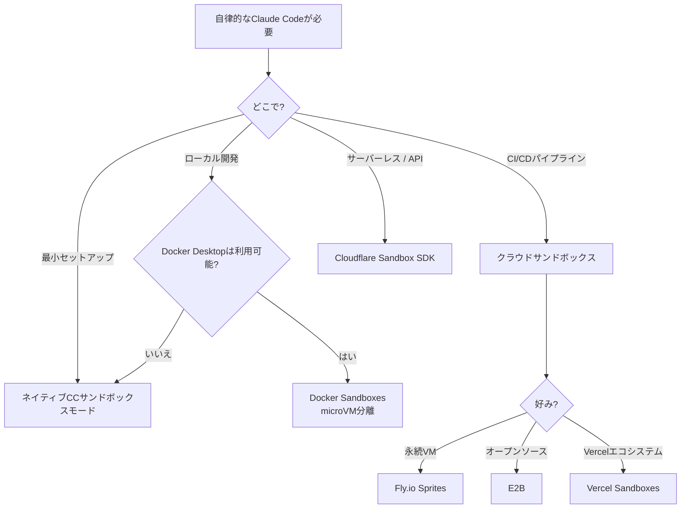

# コーディングエージェントのサンドボックス分離

> **信頼度**: Tier 2 — Dockerの公式ドキュメント + 検証済みベンダードキュメント
> **読了時間**: 約10分
> **スコープ**: 分離された環境でClaude Codeを安全に実行する

---

## TL;DR

| ソリューション | 分離 | ローカル/クラウド | 最適な用途 |
|----------|-----------|-------------|----------|
| **Docker Sandboxes** | microVM（ハイパーバイザー） | ローカル | 最大セキュリティ、Docker-in-Dockerが必要 |
| **ネイティブCCサンドボックス** | プロセス（Seatbelt/bubblewrap） | ローカル | 軽量な日常開発、信頼できるコード |
| **Fly.io Sprites** | Firecracker microVM | クラウド | API駆動のエージェントワークフロー |
| **E2B** | Firecracker microVM | クラウド | マルチフレームワークのAIアプリ |
| **Vercel Sandboxes** | Firecracker microVM | クラウド | Next.js / Vercelエコシステム |
| **Cloudflare Sandbox SDK** | コンテナ | クラウド | Workersベースのサーバーレス |

クイックスタート:

```bash
docker sandbox run claude ~/my-project
```

---

## 1. 問題: 安全な自律性

Claude Codeの権限システムは意図しないアクションからあなたを守る。しかし、それが緊張を生み出す:

- **`--dangerously-skip-permissions`** はすべてのガードレールを削除する — Claudeが確認なしに`rm -rf`、`git push --force`、または`DROP TABLE`を実行できる。ベアホスト上ではこれは危険だ。
- **権限疲れ** — すべてのファイル編集とシェルコマンドを承認することは、自律的なワークフローを遅くする。大規模なリファクタリングやCIパイプラインでは、インタラクティブな承認は非現実的だ。
- **ギャップ**: Claude Codeを自律的に**かつ**安全に実行するにはどうすればよいか？

**答え**: 実行環境を分離する。サンドボックス内でエージェントを自由に動かし、爆発半径を封じ込める。サンドボックスがセキュリティ境界であり、権限システムではない。

---

## 2. 分離アプローチ



---

## 3. Docker Sandboxes

> **出典**: [docs.docker.com/ai/sandboxes/](https://docs.docker.com/ai/sandboxes/)
> **要件**: Docker Desktop 4.58+（macOSまたはWindows）

Docker Sandboxesは、ローカルマシン上のmicroVMベースの分離でAIコーディングエージェントを実行する。各サンドボックスには独自のプライベートなDockerデーモンとファイルシステムがある。サンドボックスは`docker ps`に表示されない — それらはコンテナではなくVMだ。

### クイックスタート

```bash
# プロジェクトでサンドボックスを作成して実行
docker sandbox run claude ~/my-project

# 自律モードで実行（サンドボックス内は安全）
docker sandbox run claude ~/my-project -- --dangerously-skip-permissions

# プロンプトを直接渡す
docker sandbox run claude ~/my-project -- "認証モジュールをJWTを使用するようにリファクタリングして"

# 前のセッションを継続
docker sandbox run my-sandbox -- --continue
```

### アーキテクチャ

```
┌──────────────────────────────────────────────────────────┐
│                     ホストマシン                          │
│                                                          │
│  ┌────────────────────────────────────────────────────┐  │
│  │              DOCKER SANDBOX (microVM)               │  │
│  │                                                    │  │
│  │  ┌──────────────┐  ┌───────────────────────────┐  │  │
│  │  │ Claude Code   │  │ プライベートDockerデーモン│  │  │
│  │  │ (--dspモード) │  │ （ホストから分離）        │  │  │
│  │  └──────────────┘  └───────────────────────────┘  │  │
│  │                                                    │  │
│  │  ┌──────────────────────────────────────────────┐  │  │
│  │  │ ワークスペース: ~/my-project（ホストと同期） │  │  │
│  │  │ ホストと同じ絶対パス                         │  │  │
│  │  └──────────────────────────────────────────────┘  │  │
│  │                                                    │  │
│  │  ベース: Ubuntu、Node.js、Python 3、Go、Git、     │  │
│  │        Docker CLI、GitHub CLI、ripgrep、jq         │  │
│  │  ユーザー: sudoのある非rootの'agent'              │  │
│  └────────────────────────────────────────────────────┘  │
│                                                          │
│  ホストのDockerデーモン: サンドボックスからアクセス不可   │
│  ホストのファイルシステム: アクセス不可（ワークスペース除く）│
└──────────────────────────────────────────────────────────┘
```

主要な特性:
- **ワークスペースの同期**: ホストディレクトリがサンドボックス内の同じ絶対パスにマウントされる
- **完全な分離**: エージェントはホストのDockerデーモン、ホストのコンテナ、またはワークスペース外のファイルにアクセスできない
- **プライベートDocker**: 各サンドボックスはコンテナのビルド/実行のための独自のDockerデーモンを持つ
- **Claudeは`--dangerously-skip-permissions`で実行**: 意図的 — サンドボックスがセキュリティ境界だ

### ネットワークポリシー

サンドボックスがネットワーク上でアクセスできる内容を制御する。

```bash
# ネットワークアクティビティを表示
docker sandbox network log my-sandbox

# 拒否リストモードをセットアップ（すべてをブロック、特定を許可）
docker sandbox network proxy my-sandbox \
  --policy deny \
  --allow-host api.anthropic.com \
  --allow-host "*.npmjs.org" \
  --allow-host "*.pypi.org" \
  --allow-host github.com

# 許可リストモードをセットアップ（すべてを許可、特定をブロック）
docker sandbox network proxy my-sandbox \
  --policy allow \
  --block-host "*.malicious-domain.com" \
  --block-cidr "192.168.0.0/16"
```

| モード | デフォルトの動作 | ユースケース |
|------|-----------------|----------|
| **許可リスト**（デフォルト） | ほとんどのトラフィックを許可し、特定の宛先をブロック | 一般的な開発 |
| **拒否リスト** | すべてのトラフィックをブロックし、指定された宛先のみを許可 | 高セキュリティ環境 |

**デフォルトでブロックされる範囲**: プライベートCIDR（`10.0.0.0/8`、`127.0.0.0/8`、`172.16.0.0/12`、`192.168.0.0/16`、`169.254.0.0/16`）とIPv6の同等物。

**パターンマッチング**: 完全一致（`example.com`）、ポート固有（`example.com:443`）、ワイルドカード（`*.example.com`はサブドメインのみに一致）。最も具体的なパターンが優先される。

**セキュリティ上の注意**: ドメインフィルタリングはトラフィックの内容を検査しない。広範な許可（例: `github.com`）はユーザー生成コンテンツへのアクセスを許可する。バイパスモードではHTTPS検査は実施されない。

**設定の保存場所**: サンドボックスごとに`~/.docker/sandboxes/vm/[name]/proxy-config.json`。ポリシーは再起動後も持続する。

### カスタムテンプレート

特定のツールで再現可能な環境が必要なチームのために:

```dockerfile
FROM docker/sandbox-templates:claude-code

USER root

# プロジェクト固有の依存関係をインストール
RUN apt-get update && apt-get install -y \
    postgresql-client \
    redis-tools

# グローバルnpmパッケージをインストール
RUN npm install -g pnpm turbo

USER agent
```

ビルドと使用:

```bash
# テンプレートをビルド
docker build -t my-team-sandbox:v1 .

# カスタムテンプレートでサンドボックスを作成
docker sandbox create my-sandbox \
  --template my-team-sandbox:v1 \
  --load-local-template ~/my-project
```

カスタムテンプレートを使用するのは: チーム環境、特定のツールバージョン、繰り返しのセットアップ、複雑な設定の場合。シンプルな一回限りの作業では、デフォルトを使用してエージェントが必要なものをインストールさせる。

### コマンドリファレンス

| コマンド | 説明 |
|---------|-------------|
| `docker sandbox run <agent> <path>` | サンドボックスを作成して起動 |
| `docker sandbox create <name>` | 起動せずに作成 |
| `docker sandbox ls` | すべてのサンドボックスをリスト |
| `docker sandbox run <name> -- "prompt"` | プロンプトを渡す |
| `docker sandbox run <name> -- --continue` | 前のセッションを継続 |
| `docker sandbox run <name> -- --dsp` | --dangerously-skip-permissionsの省略形 |
| `docker sandbox network proxy <name>` | ネットワークポリシーを設定 |
| `docker sandbox network log <name>` | ネットワークアクティビティを表示 |

### 認証

**オプション1: APIキー（ヘッドレスに推奨）**

`~/.bashrc`または`~/.zshrc`に`ANTHROPIC_API_KEY`を設定する。サンドボックスデーモンは現在のシェルセッションではなく、これらのファイルから読み込む。変更後はデーモンを再起動すること。サンドボックスの再作成後も持続する。

**オプション2: インタラクティブログイン（セッションごと）**

認証情報が見つからない場合に自動的にトリガーされる。手動でトリガーするには、Claude Code内で`/login`を使用する。サンドボックスが破棄されると認証は**持続しない**。

### サポートされているエージェント

| エージェント | プロバイダー | ステータス |
|-------|----------|--------|
| Claude Code | Anthropic | フルサポート |
| Codex CLI | OpenAI | サポート |
| Gemini CLI | Google | サポート |
| cagent | Docker | サポート |
| Kiro | AWS | サポート |

### 制限事項

- **macOSとWindowsのみ**でmicroVMモードが利用可能。Linuxはレガシーコンテナベースのサンドボックスを使用（Docker Desktop 4.57+）。
- **Docker Desktopが必要** — スタンドアロンのDocker Engineでは利用不可。[dclaude](https://github.com/jedi4ever/dclaude)（Patrick Debois）のようなコミュニティの代替手段はClaude CodeをDockerコンテナにラップするが、コンテナ分離（microVMではなく）を使用してホストのDockerソケットをマウントするため、セキュリティ境界が弱い。
- **MCPゲートウェイはまだサポートされていない**サンドボックス内では。
- **GPUパススルーなし** — MLトレーニングワークロードには適していない。
- **ワークスペースの同期は一方向**: サンドボックス内の変更はホストに伝播するが、ホストの同時編集は競合する可能性がある。

---

## 4. ネイティブClaude Codeサンドボックス

> **出典**: [code.claude.com/docs/en/sandboxing](https://code.claude.com/docs/en/sandboxing)
> **要件**: macOS（組み込み）またはLinux/WSL2（bubblewrap + socat）
> **機能**: Claude Code v2.1.0+

Claude CodeにはOSレベルのプリミティブを使用したプロセスレベルの分離のための組み込み**ネイティブサンドボックス**が含まれている。Dockerは不要だ。

### アーキテクチャ

```
┌──────────────────────────────────────────────────────┐
│                    ホストマシン                      │
│                                                      │
│  Claude Code（メインプロセス）                        │
│       │                                              │
│       ├─ bashコマンドを起動                          │
│       │                                              │
│       ▼                                              │
│  サンドボックスラッパー（Seatbelt/bubblewrap）        │
│       │                                              │
│       ├─ ファイルシステム: すべてを読み取り、CWDのみ書き込み │
│       ├─ ネットワーク: SOCKS5プロキシ、ドメインフィルタリング │
│       ├─ プロセス: 分離された環境                    │
│       │                                              │
│       ▼                                              │
│  コマンドが制限付きで実行される                       │
│       │                                              │
│       └─ 違反はOSレベルでブロックされる              │
│                                                      │
└──────────────────────────────────────────────────────┘
```

**Docker Sandboxesとの主な違い**:

| 側面 | ネイティブサンドボックス | Docker Sandboxes |
|--------|---------------|------------------|
| **分離レベル** | プロセス（Seatbelt/bubblewrap） | microVM（ハイパーバイザー） |
| **カーネル** | ホストと共有 | サンドボックスごとに別カーネル |
| **セットアップ** | 0依存（macOS）、2パッケージ（Linux） | Docker Desktop 4.58+ |
| **オーバーヘッド** | 最小限（~1〜3% CPU） | 中程度（~5〜10% CPU、+200MB RAM） |
| **Docker-in-Docker** | ❌ 未サポート | ✅ プライベートDockerデーモン |
| **ユースケース** | 日常開発、信頼できるコード | 信頼できないコード、最大分離 |

### OSプリミティブ

**macOS**: Seatbelt（TrustedBSD必須アクセス制御）を使用
- 組み込み、すぐに動作する
- カーネルレベルのシステムコールフィルタリング

**Linux/WSL2**: bubblewrap（Linuxの名前空間 + seccomp）を使用
- インストールが必要: `sudo apt-get install bubblewrap socat`
- コマンドごとに分離された名前空間を作成する

**WSL1**: ❌ 未サポート（bubblewrapには利用不可のカーネル機能が必要）

**Windows ネイティブ**: ⏳ 計画中（まだ利用不可）

### クイックスタート

```bash
# サンドボックスを有効化（インタラクティブメニュー）
/sandbox

# Linux/WSL2のみ: まず前提条件をインストール
sudo apt-get install bubblewrap socat  # Ubuntu/Debian
sudo dnf install bubblewrap socat      # Fedora
```

**2つのモード**:

1. **自動許可モード**: サンドボックス内ならbashコマンドを自動承認（日常開発に推奨）
2. **通常権限モード**: すべてのコマンドに承認が必要（高セキュリティ向け）

### 設定例

```json
{
  "sandbox": {
    "autoAllowMode": true,
    "network": {
      "policy": "deny",
      "allowedDomains": [
        "api.anthropic.com",
        "registry.npmjs.com",
        "github.com"
      ]
    }
  },
  "permissions": {
    "deny": [
      "Read(~/.ssh/**)", "Read(~/.aws/**)",
      "Edit(~/.ssh/**)", "Edit(~/.aws/**)"
    ]
  }
}
```

### ネイティブ対Dockerをいつ使用するか

**ネイティブサンドボックスを使用する場合**:
- ✅ 信頼できるチームとの日常開発
- ✅ 軽量セットアップ（Docker Desktopなし）
- ✅ オーバーヘッドを最小限にしたい
- ✅ コードがほぼ信頼できる
- ✅ Docker-in-Dockerが不要

**Docker Sandboxesを使用する場合**:
- ✅ 信頼できないコードを実行する
- ✅ 最大セキュリティ分離（カーネルエクスプロイト保護）
- ✅ サンドボックス内のプライベートDockerデーモンが必要
- ✅ AIが生成したスクリプトのテスト
- ✅ 機密性の高いワークロードを持つ本番CI/CD

**決定ツリー**:

```
日常開発?
├─ 信頼できるコード + チーム → ネイティブサンドボックス（軽量）
└─ 信頼できないスクリプト → Docker Sandboxes（最大分離）

内部でDockerが必要?
├─ はい → Docker Sandboxes（唯一のオプション）
└─ いいえ → どちらでも可、シンプルさならネイティブを優先

最大セキュリティ?
├─ はい（カーネルエクスプロイト保護） → Docker Sandboxes
└─ 標準（プロセス分離で十分） → ネイティブサンドボックス
```

### セキュリティの制限事項

**⚠️ ネイティブサンドボックスの制限事項**（詳細は[guide/sandbox-native.md](./sandbox-native.md)参照）:

1. **共有カーネル**: カーネルエクスプロイトに対して脆弱（DockerのmicroVMはこれを保護する）
2. **ドメインフロンティング**: CDNベースのバイパスが可能（Cloudflare、Akamai）
3. **Unixソケット**: 設定が誤っている場合、予期しない権限が付与される可能性がある
4. **ファイルシステム**: 過度に広い書き込み権限により権限昇格が可能

**信頼できないコードの場合**、Docker Sandboxesはより強力な分離を提供する。

### オープンソースランタイム

サンドボックスの実装はオープンソースのnpmパッケージとして利用可能:

```bash
# サンドボックスランタイムを直接使用
npx @anthropic-ai/sandbox-runtime <command-to-sandbox>

# 例: MCPサーバーをサンドボックス化
npx @anthropic-ai/sandbox-runtime node mcp-server.js
```

**リポジトリ**: [github.com/anthropic-experimental/sandbox-runtime](https://github.com/anthropic-experimental/sandbox-runtime)

### 詳細情報

完全な技術的詳細、設定例、トラブルシューティング、セキュリティ分析については:

→ **[ネイティブサンドボックスガイド](./sandbox-native.md)**

カバー内容: OSプリミティブ、ネットワークプロキシアーキテクチャ、サンドボックスモード、エスケープハッチ、セキュリティの制限事項、ベストプラクティス。

---

## 5. クラウドサンドボックスの概観

### Fly.io Sprites

> **出典**: [sprites.dev](https://sprites.dev)

Fly.ioによるFirecracker microVMを基盤としたハードウェア分離実行環境。

- **分離**: 完全なハードウェア分離を持つFirecracker microVM
- **永続性**: 完全にミュータブルなext4ファイルシステム、自動100GBパーティション
- **チェックポイント/リストア**: ライブチェックポイントが~300ms（コピーオンライト）、リストアが1秒未満
- **HTTPアクセス**: Spriteごとの個別URL、リクエスト時の自動アクティベーション（コールドスタートが1秒未満）
- **ネットワーク**: レイヤー3のエグレスポリシー、パブリック/プライベートの切り替え
- **リソース**: Spriteごとに最大8 CPU、16GB RAM
- **API**: CLI（`sprite`コマンド）、REST API、JavaScriptとGoのクライアントライブラリ
- **料金**: 従量課金（$0.07/CPU時間、$0.04/GB時間）。トライアルクレジット$30。

### Cloudflare Sandbox SDK

> **出典**: [developers.cloudflare.com/sandbox/](https://developers.cloudflare.com/sandbox/)

CloudflareのWorkersプラットフォームを基盤とした、分離されたコンテナでのセキュアなコード実行。

- **分離**: Cloudflareのサーバーレスランタイム上のコンテナ（microVMではない）
- **言語**: Python、JavaScript/TypeScript、シェルコマンド
- **永続性**: ローカルファイルシステムパスとしてのR2バケットマウント
- **API**: TypeScript SDK（`getSandbox()`、`exec()`、`runCode()`、ファイル操作、WebSocket）
- **統合**: Claudeがコードを生成し、Sandboxがそれを実行し、結果がテキスト/ビジュアライゼーションとして返される
- **料金**: Workers有料プランが必要。Containersプラットフォームの料金に基づく。
- **チュートリアル**: [developers.cloudflare.com/sandbox/tutorials/claude-code/](https://developers.cloudflare.com/sandbox/tutorials/claude-code/)

### Vercel Sandboxes

> **出典**: [vercel.com/docs/vercel-sandbox/](https://vercel.com/docs/vercel-sandbox/)

AIエージェントとコード生成のための一時的なLinux microVM。2026-01-30にGA。

- **分離**: Firecracker microVM、環境変数、DB、クラウドリソースから分離
- **パフォーマンス**: サブ秒の初期化、タスク完了時に自動終了
- **タイムアウト**: デフォルト5分、Hobbyは最大45分、Pro/Enterpriseは最大5時間
- **SDK**: `Sandbox`、`Command`、`Snapshot`クラス。繰り返し実行の高速化のためのファイルシステムスナップショット。
- **認証**: Vercel OIDCトークン（推奨）または外部CI/CD用のアクセストークン
- **統合**: 自律エージェントタスクのためのClaudeのAgent SDKと連動

### E2B

> **出典**: [e2b.dev](https://e2b.dev)

AIエージェントとLLMアプリケーション向けのオープンソースサンドボックスプラットフォーム。

- **分離**: Firecracker microVM（AWS Lambdaと同じ技術）
- **パフォーマンス**: コールドブート~150ms、スタンバイレジューム25ms未満
- **カスタムイメージ**: 最大10GB、2秒未満でブート（Blueprints）
- **スナップショット**: VMの完全な状態をキャプチャしてリストア
- **言語**: Python、JavaScript、Ruby、C++、Linuxで動作するすべて。LLM非依存。
- **統合**: LangChain、LangGraph、LlamaIndex、Vercel/Next.js、Ollama
- **デプロイ**: クラウドホスト、BYOC（AWS/GCP/Azure）、オンプレミス/VPCでのセルフホスト
- **料金**: 無料ティア（クレジット$100、最大1時間）、Proは月$150から（最大24時間）

### ネイティブClaude Codeサンドボックスモード

> **出典**: [code.claude.com/docs/en/sandboxing](https://code.claude.com/docs/en/sandboxing)

Claude Codeの組み込みプロセスレベルサンドボックス（[アーキテクチャ](../core/architecture.md)のレイヤー4）。

- **外部依存関係なし**: すぐに動作する
- **プロセス分離**: Claudeが実行できるコマンドを制限する
- **設定可能**: 設定の`allowedTools`を通じて
- **制限事項**: 完全なVM分離ではない — ホストのカーネルとファイルシステムを共有する

使用するのは: Dockerが利用不可、軽量な分離で十分、またはサンドボックスと組み合わせた多層防御が必要な場合。

---

## 6. 比較マトリックス

| 基準 | Docker Sandboxes | ネイティブCC | Fly.io Sprites | Cloudflare SDK | E2B | Vercel Sandboxes |
|-----------|-----------------|-----------|----------------|----------------|-----|-----------------|
| **分離レベル** | microVM（ハイパーバイザー） | プロセス（Seatbelt/bubblewrap） | Firecracker microVM | コンテナ | Firecracker microVM | Firecracker microVM |
| **カーネル分離** | ✅ 別カーネル | ❌ 共有カーネル | ✅ 別カーネル | 部分的 | ✅ 別カーネル | ✅ 別カーネル |
| **ローカル実行** | はい | はい | いいえ（クラウド） | いいえ（クラウド） | いいえ（クラウド） | いいえ（クラウド） |
| **セットアップ** | Docker Desktop 4.58+ | 0依存（macOS）、2パッケージ（Linux） | APIキー | Workers有料 | APIキー | SDK |
| **Docker-in-Docker** | ✅ プライベートデーモン | ❌ 未サポート | はい | いいえ | はい | はい |
| **ネットワーク制御** | 許可/拒否リスト | 許可/拒否リスト（SOCKS5） | L3エグレスポリシー | 詳細不明 | 詳細不明 | 詳細不明 |
| **プラットフォーム** | macOS、Windows（WSL2） | macOS、Linux、WSL2 | 任意（API） | 任意（Workers） | 任意（API/SDK） | 任意（SDK） |
| **オーバーヘッド** | 中程度（~5〜10% CPU） | 最小限（~1〜3% CPU） | クラウド | クラウド | クラウド | クラウド |
| **無料ティア** | Docker Desktop | 無料 | クレジット$30 | Workers有料 | クレジット$100 | あり（制限付き） |
| **最適な用途** | 最大セキュリティ、Docker必要 | 日常開発、信頼できるコード | API駆動エージェント | サーバーレス | マルチフレームワーク | Next.js/Vercel |

---

## 7. 安全な自律ワークフロー

### パターン: Docker Sandbox + --dangerously-skip-permissions

ローカルの自律開発に推奨されるパターン:

```bash
# 1. プロジェクトでサンドボックスを作成
docker sandbox create my-feature ~/my-project

# 2. ネットワークを設定（オプション、セキュリティに推奨）
docker sandbox network proxy my-feature \
  --policy deny \
  --allow-host api.anthropic.com \
  --allow-host "*.npmjs.org" \
  --allow-host github.com

# 3. Claudeを自律的に実行（サンドボックス内は安全）
docker sandbox run my-feature -- --dangerously-skip-permissions \
  "認証モジュールをJWTを使用するようにリファクタリングして。終了前にすべてのテストを実行して。"

# 4. ホストで変更を確認（ワークスペースは自動的に同期される）
cd ~/my-project && git diff

# 5. 満足したらコミット。そうでなければ、破棄または再実行。
git add -A && git commit -m "feat: JWT認証（サンドボックス生成）"
```

### パターン: サンドボックスを使用したCI/CDパイプライン

GitHub Actionsのスケッチ:

```yaml
jobs:
  agent-task:
    runs-on: ubuntu-latest
    steps:
      - uses: actions/checkout@v4

      - name: E2Bサンドボックス内でClaudeを実行
        uses: e2b-dev/e2b-github-action@v1
        with:
          api-key: ${{ secrets.E2B_API_KEY }}
          command: |
            claude --dangerously-skip-permissions \
              -p "完全なテストスイートを実行して、失敗を修正して"
```

CI/CDでは、Docker Desktopが不要なため、クラウドサンドボックス（E2B、Vercel、Sprites）の方がDocker Sandboxesより一般的に優れている。

---

## 8. アンチパターン

| アンチパターン | なぜ危険か | 代わりにすること |
|-------------|-------------------|------------|
| サンドボックスなしの`--dangerously-skip-permissions` | エージェントがホストのファイルシステム、ネットワーク、Dockerに無制限にアクセスできる | セキュリティ境界としてサンドボックスを使用する |
| コンテナ = VMと仮定する | コンテナはホストのカーネルを共有する。コンテナエスケープはホストを露出させる | 強力な分離にはmicroVMベースのソリューション（Docker Sandboxes、E2B、Sprites）を使用する |
| ファイルシステム全体をサンドボックスにマウントする | 分離の目的を無効にする。エージェントが認証情報、SSHキーなどにアクセスできる | プロジェクトのワークスペースディレクトリのみをマウントする |
| ネットワークポリシーで`*`を許可リストにする | エージェントが任意のエンドポイントにデータを送信できる | 明示的な許可を持つ拒否リストモードを使用する |
| サンドボックス実行後に`git diff`のレビューをスキップする | 自律エージェントが意図しない変更を行った可能性がある | サンドボックス生成コードをコミットする前に常に差分をレビューする |
| サンドボックスをコードレビューをスキップする言い訳にする | 分離はホストを保護するが、コードの品質は保護しない | サンドボックス + コードレビューは補完的であり、代替ではない |

---

## 関連情報

- [architecture.md](../core/architecture.md) — レイヤー4（サブエージェントアーキテクチャ）と権限モデル
- [security-hardening.md](./security-hardening.md) — MCPの審査、インジェクション防御、CVEの追跡
- [code.claude.com/docs/en/sandboxing](https://code.claude.com/docs/en/sandboxing) — Claude Codeの公式サンドボックスドキュメント
- [docs.docker.com/ai/sandboxes/](https://docs.docker.com/ai/sandboxes/) — Docker Sandboxesのドキュメント
