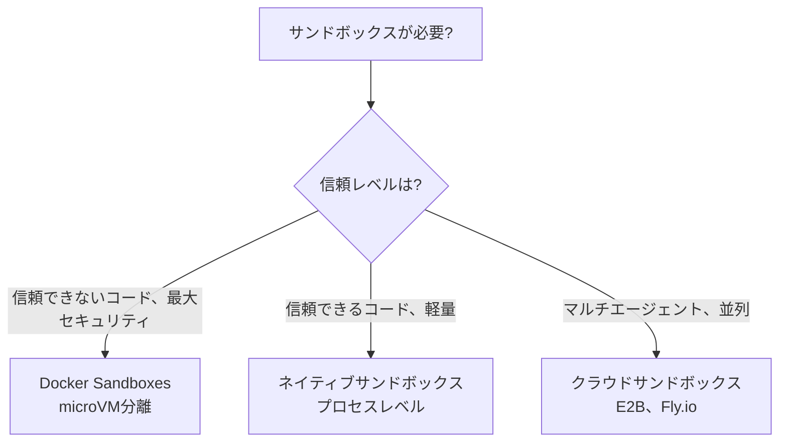
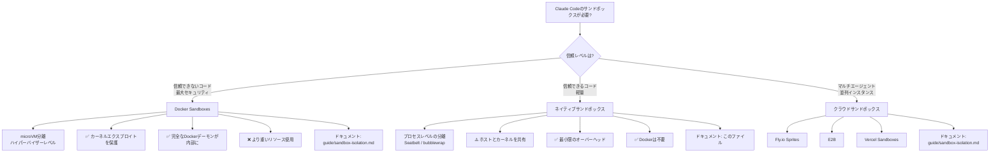

# Claude Codeのネイティブサンドボックス

> **信頼度**: Tier 1 — Anthropicの公式ドキュメント
> **読了時間**: 約15分
> **スコープ**: Claude Codeのネイティブなプロセスレベルサンドボックスの理解と設定
> **最終更新**: 2026-02-02

---

## TL;DR

Claude CodeにはOSレベルのプリミティブを使用してbashコマンドを分離する組み込みの**ネイティブサンドボックス**（v2.1.0+）が含まれている:

| 側面 | 詳細 |
|--------|---------|
| **macOS** | Seatbelt（組み込み、すぐに動作する） |
| **Linux/WSL2** | bubblewrap + socat（インストールが必要） |
| **ファイルシステム** | すべて読み取り（設定可能）、ワークスペースのみ書き込み |
| **ネットワーク** | SOCKS5プロキシ、ドメインの許可リスト/拒否リスト |
| **モード** | 自動許可（bashを自動承認）対通常権限 |
| **エスケープハッチ** | 互換性のないツールのための`dangerouslyDisableSandbox` |
| **プラットフォームサポート** | ✅ macOS、Linux、WSL2 • ❌ WSL1 • ⏳ Windows（計画中） |

**クイックスタート**:

```bash
# サンドボックスを有効化
/sandbox

# Linux/WSL2の前提条件
sudo apt-get install bubblewrap socat  # Ubuntu/Debian
sudo dnf install bubblewrap socat      # Fedora
```

**ネイティブ対Docker Sandboxesをいつ使用するか**:



---

## 1. なぜネイティブサンドボックスか？

### 自律性とセキュリティのトレードオフ

Claude Codeの権限システムは根本的なトレードオフを生み出す:

- **`--dangerously-skip-permissions`** はすべてのガードレールを削除する → 速くて自律的だが、ベアホスト上では危険
- **インタラクティブ権限** → 安全だが、大規模なリファクタリングには遅くて非現実的

**ネイティブサンドボックスはこれを解決する**: ClaudeをOSが強制する境界の内側で自由に動かす。サンドボックスがセキュリティの外周となり、権限システムではない。

### メリット

1. **承認疲れの軽減** — サンドボックス内で安全なコマンドが自動承認される
2. **自律的なワークフロー** — 常時プロンプトなしの大規模なリファクタリング、CIパイプライン
3. **プロンプトインジェクション保護** — 悪意あるプロンプトがサンドボックス境界を脱出できない
4. **依存関係の安全性** — 侵害されたnpmパッケージがワークスペース内に封じ込められる
5. **透過的な操作** — サンドボックスの違反が即座に通知をトリガーする

---

## 2. OSプリミティブ

ネイティブサンドボックスはOSのセキュリティメカニズムを使用して分離を強制する:

### macOS: Seatbelt

**組み込み、すぐに動作する** — インストールは不要。

- **メカニズム**: macOSサンドボックスフレームワーク（TrustedBSD必須アクセス制御）
- **強制**: カーネルレベルのシステムコールフィルタリング
- **スコープ**: ファイルシステム、ネットワーク、IPCのプロセスごとの制限
- **パフォーマンス**: 最小限のオーバーヘッド（典型的なワークロードで~1〜2% CPU）

**仕組み**:

```
┌─────────────────────────────────────────────────────┐
│              macOS Seatbeltアーキテクチャ           │
├─────────────────────────────────────────────────────┤
│                                                     │
│  Claude Codeプロセス                                 │
│       │                                             │
│       ├─ bashコマンドを起動                         │
│       │                                             │
│       ▼                                             │
│  Seatbeltポリシーが適用される                        │
│       │                                             │
│       ├─ ファイルシステムルール: すべて読み取り、CWDに書き込み │
│       ├─ ネットワークルール: すべての接続をプロキシ  │
│       ├─ IPCルール: 制限されたプロセス通信          │
│       │                                             │
│       ▼                                             │
│  カーネルが制限を強制する                            │
│       │                                             │
│       ├─ 許可: 境界内の操作                         │
│       ├─ ブロック: 境界外の操作                     │
│       └─ 通知: ユーザーにアラートが届く             │
│                                                     │
└─────────────────────────────────────────────────────┘
```

### Linux/WSL2: bubblewrap

**インストールが必要** — `bubblewrap`と`socat`パッケージをインストールしなければならない。

- **メカニズム**: Linuxの名前空間 + seccomp-bpfシステムコールフィルタリング
- **強制**: カーネルの名前空間分離（マウント、ネットワーク、PID、IPC）
- **スコープ**: 各コマンドのためにコンテナに似た分離環境を作成する
- **パフォーマンス**: 最小限のオーバーヘッド（~2〜3% CPU、コマンドごとに10ms未満の起動）

**前提条件**:

```bash
# Ubuntu/Debian
sudo apt-get install bubblewrap socat

# Fedora
sudo dnf install bubblewrap socat

# Arch Linux
sudo pacman -S bubblewrap socat
```

**仕組み**:

```
┌─────────────────────────────────────────────────────┐
│           Linux bubblewrapアーキテクチャ            │
├─────────────────────────────────────────────────────┤
│                                                     │
│  Claude Codeプロセス（ホスト名前空間）               │
│       │                                             │
│       ├─ bashコマンドを起動                         │
│       │                                             │
│       ▼                                             │
│  bubblewrapが分離された名前空間を作成する            │
│       │                                             │
│       ├─ マウント名前空間: カスタムファイルシステムビュー │
│       ├─ ネットワーク名前空間: socatでプロキシ       │
│       ├─ PID名前空間: 分離されたプロセスツリー       │
│       ├─ IPC名前空間: 共有メモリアクセスなし        │
│       │                                             │
│       ▼                                             │
│  コマンドが分離された環境で実行される                │
│       │                                             │
│       ├─ ファイルシステム: 許可されたパスのみ表示   │
│       ├─ ネットワーク: すべての接続がプロキシされる  │
│       ├─ プロセス: ホストのプロセスを見ることができない │
│       │                                             │
│       ▼                                             │
│  結果がClaude Codeに返される                        │
│                                                     │
└─────────────────────────────────────────────────────┘
```

### WSL2対WSL1

- **WSL2**: ✅ サポート（bubblewrapを使用、Linuxと同じ）
- **WSL1**: ❌ **未サポート** — bubblewrapにはWSL1のトランスレーションレイヤーでは利用不可のカーネル機能（名前空間、cgroups）が必要

**マイグレーションが必要**: WSL1を使用している場合、ネイティブサンドボックスを使用するために[WSL2にアップグレード](https://learn.microsoft.com/en-us/windows/wsl/install)すること。

---

## 3. ファイルシステム分離

### デフォルトの動作

- **読み取りアクセス**: コンピュータ全体（明示的に拒否されたディレクトリを除く）
- **書き込みアクセス**: カレントワーキングディレクトリ（CWD）とそのサブディレクトリのみ
- **ブロック**: 明示的な許可なしでのCWD外の変更

### なぜ「すべて読み取り、CWDに書き込み」なのか？

この非対称なポリシーはユーザビリティとセキュリティのバランスを取る:

- **すべて読み取り**: Claudeはコードベース全体を検索/分析し、システム設定を読み込み、依存関係を検査する必要がある
- **CWDに書き込み**: ほとんどの開発作業はプロジェクトディレクトリ内で行われる。書き込みを制限することで偶発的/悪意あるシステム変更を防ぐ

### ファイルシステム制限の設定

ファイルシステム制限はサンドボックス設定ではなく**権限ルール**（Read/Editの拒否ルール）を通じて設定される:

```json
{
  "permissions": {
    "deny": [
      "Read(~/.ssh/**)",
      "Read(~/.aws/**)",
      "Read(~/.kube/**)",
      "Edit(~/.ssh/**)",
      "Edit(~/.aws/**)",
      "Edit(~/.kube/**)"
    ]
  }
}
```

書き込みアクセスはサンドボックスによって固有にCWDに制限される。機密ディレクトリへの読み取りをブロックするには、上記のように権限拒否ルールを使用する。

**⚠️ セキュリティ警告**: 過度に広い書き込み権限は権限昇格を可能にする:

- ❌ **絶対に書き込みを許可しないこと**: `$PATH`ディレクトリ（`/usr/local/bin`）、シェル設定（`~/.bashrc`、`~/.zshrc`）、システムディレクトリ（`/etc`）
- ✅ **安全に許可できること**: プロジェクトディレクトリ、一時ディレクトリ（`/tmp`）、ビルド出力ディレクトリ

---

## 4. ネットワーク分離

### プロキシアーキテクチャ

サンドボックス化されたコマンドからのすべてのネットワーク接続は、サンドボックスの**外側**で動作するSOCKS5プロキシを通じてルーティングされる。プロキシはプロセスが接続できるドメインを制限するが、通過するトラフィックの内容は**検査しない**（プライバシーに関する注意: ディープパケットインスペクションなし）。

```
┌──────────────────────────────────────────────────────────┐
│                    ネットワークフロー                    │
├──────────────────────────────────────────────────────────┤
│                                                          │
│  サンドボックス化されたbashコマンド                       │
│       │                                                  │
│       ├─ api.anthropic.com:443への接続を試みる           │
│       │                                                  │
│       ▼                                                  │
│  SOCKS5プロキシ（サンドボックス外）                       │
│       │                                                  │
│       ├─ ドメインの許可リスト/拒否リストを確認            │
│       │                                                  │
│       ├─ 許可？ → 接続を転送                             │
│       ├─ ブロック？ → 拒否してユーザーに通知             │
│       │                                                  │
│       ▼                                                  │
│  外部ネットワーク（許可された場合）                        │
│                                                          │
└──────────────────────────────────────────────────────────┘
```

### ドメインフィルタリング

**2つのモード**:

1. **許可リスト（デフォルト）**: ほとんどのトラフィックを許可し、特定の宛先をブロック
2. **拒否リスト**: すべてのトラフィックをブロックし、指定された宛先のみを許可

**設定**:

```json
{
  "sandbox": {
    "network": {
      "policy": "deny",
      "allowedDomains": [
        "api.anthropic.com",
        "*.npmjs.org",
        "*.pypi.org",
        "github.com",
        "registry.yarnpkg.com"
      ]
    }
  }
}
```

**パターンマッチング**:

- **完全一致**: `example.com`（正確に一致）
- **ポート固有**: `example.com:443`（HTTPSのみ）
- **ワイルドカード**: `*.example.com`（`sub.example.com`に一致するが、`example.com`自体には**一致しない**）

**⚠️ デフォルトでブロックされる範囲**: プライベートCIDR（`10.0.0.0/8`、`127.0.0.0/8`、`172.16.0.0/12`、`192.168.0.0/16`、`169.254.0.0/16`）

### カスタムプロキシ

高度なユースケース（HTTPS検査、エンタープライズプロキシ）のために:

```json
{
  "sandbox": {
    "network": {
      "httpProxyPort": 8080,
      "socksProxyPort": 8081
    }
  }
}
```

---

## 5. サンドボックスモード

### 自動許可モード

**動作**:

- Bashコマンドがサンドボックス内で実行される場合は**自動承認**される
- サンドボックスと互換性のないコマンド（例: 許可されていないドメインが必要）→ 通常の権限フローにフォールバック
- 明示的なask/denyルールは**常に尊重される**

**⚠️ 重要**: 自動許可モードは権限モード（デフォルト/自動受け入れ/プラン）から**独立している**。「デフォルト」モードでも、サンドボックス化されたbashコマンドはプロンプトなしで実行される。

**組み込みブロックリスト**: 自動許可モードでも、`curl`と`wget`のようなコマンドはデフォルトでブロックされ、任意のウェブコンテンツの取得を防ぐ。

**使用するタイミング**: 日常開発、自律的なリファクタリング、CI/CDパイプライン

### 通常権限モード

**動作**:

- サンドボックス化されていても、すべてのbashコマンドに明示的な承認が必要
- サンドボックスはまだファイルシステム/ネットワーク制限を強制する
- より多くの制御だが、遅いワークフロー

**使用するタイミング**: 高セキュリティ環境、信頼できないコードベース、Claude Codeの動作を学習中

### モードの切り替え

```bash
# インタラクティブメニュー
/sandbox

# またはsettings.jsonを編集
{
  "sandbox": {
    "autoAllowMode": true  # または通常権限にはfalse
  }
}
```

---

## 6. エスケープハッチ

### `dangerouslyDisableSandbox`パラメーター

一部のツールはサンドボックスと**互換性がない**（例: `docker`、`watchman`）。Claude Codeにはエスケープハッチが含まれている:

**仕組み**:

1. サンドボックスの制限によりコマンドが失敗する
2. Claudeが失敗を分析する
3. Claudeが`dangerouslyDisableSandbox`パラメーターで再試行する
4. ユーザーが権限プロンプトを受け取る（通常のClaude Codeフロー）
5. 承認された場合、コマンドはサンドボックスの**外側**で実行される

**互換性のないツールの例**:

- `docker`（`/var/run/docker.sock`へのアクセスが必要）
- `watchman`（ファイルシステムウォッチAPIが必要）
- watchmanを使用する`jest`（代わりに`jest --no-watchman`を使用）

### エスケープハッチの無効化

最大セキュリティのためにエスケープハッチを完全に無効化する:

```json
{
  "sandbox": {
    "allowUnsandboxedCommands": false
  }
}
```

無効化されると:

- `dangerouslyDisableSandbox`パラメーターは**完全に無視される**
- すべてのコマンドはサンドボックス化されて実行するか、`excludedCommands`に明示的にリストされなければならない

**推奨対象**: 本番CI/CD、信頼できない環境、高セキュリティコンテキスト

### `excludedCommands`

サンドボックス内で**絶対に**動作しないツールのために、永続的に除外する:

```json
{
  "sandbox": {
    "excludedCommands": ["docker", "kubectl", "vagrant"]
  }
}
```

除外されたコマンドは常にサンドボックスの外側で実行される（通常の権限プロンプト付き）。

---

## 7. セキュリティの制限事項

### ドメインフロンティング

**リスク**: CDN（Cloudflare、Akamai）はユーザーのコンテンツを信頼できるドメインでホストすることを許可する。

**攻撃シナリオ**:

1. 攻撃者が`cloudflare.com`を許可リストに入れる
2. 攻撃者がCloudflare Workers（`cloudflare.com`のサブドメイン）に悪意あるペイロードをアップロードする
3. 侵害されたエージェントが許可リストのドメイン経由でペイロードをダウンロードする
4. データの外部送信が成功する

**対策**:

- ❌ **広範なCDNドメインを避ける**: `*.cloudflare.com`、`*.akamai.net`、`*.fastly.net`
- ✅ **特定のサブドメインを許可リストに入れる**: `my-app.pages.dev`、`my-workers.workers.dev`
- ✅ **信頼できない環境には拒否リストモードを使用する**

**完全なブロックの不可能性**: ドメインフロンティングはHTTPS検査なしでは[防ぐことが難しい](https://en.wikipedia.org/wiki/Domain_fronting)。

### Unixソケットの権限昇格

**リスク**: `allowUnixSockets`設定が強力なシステムサービスへのアクセスを許可する可能性がある。

**攻撃シナリオ**:

1. ユーザーが`/tmp/*.sock`を許可（安全と思って）
2. 侵害されたエージェントが`/tmp/supervisor.sock`（プロセスマネージャー）に接続
3. エージェントがサンドボックス外の特権プロセスを起動
4. システム全体の侵害

**一般的な脆弱なソケット**:

- `/var/run/docker.sock`（Dockerデーモン - 完全なホストアクセス）
- `/run/containerd/containerd.sock`（containerd - コンテナ制御）
- `/tmp/supervisor.sock`（supervisord - プロセス管理）
- `~/.config/systemd/user/bus`（systemdユーザーバス - サービス制御）

**対策**:

- ❌ **広範なパターンを絶対に許可しない**: `/tmp/*.sock`、`/var/run/*.sock`
- ✅ **監査後に特定のソケットを許可リストに入れる**: `/run/postgresql/.s.PGSQL.5432`（PostgreSQL）
- ✅ **デフォルト**: Unixソケットは明示的に許可されない限り**ブロックされる**

### ファイルシステム権限の昇格

**リスク**: 過度に広い書き込み権限が権限昇格を可能にする。

**攻撃シナリオ**:

1. ユーザーが`/usr/local/bin`への書き込みを許可
2. 侵害されたエージェントが`/usr/local/bin/sudo`（悪意あるバイナリ）を作成
3. 次回ユーザーが`sudo`を実行すると、悪意あるバイナリが実行される
4. システムの侵害

**脆弱なディレクトリ**:

- `$PATH`ディレクトリ（`/usr/local/bin`、`~/bin`）
- シェル設定ファイル（`~/.bashrc`、`~/.zshrc`、`~/.profile`）
- システムディレクトリ（`/etc`、`/opt`、`/Library`）
- Cronディレクトリ（`/etc/cron.d`、`/var/spool/cron`）

**対策**:

- ✅ **書き込みをプロジェクトディレクトリのみに制限する**（サンドボックスのデフォルト）
- ✅ **権限拒否ルールを使用して機密の読み取りをブロックする**
- ✅ **サンドボックスの違反ログを監視する**

### Linux: ネストされたサンドボックスの脆弱性

**リスク**: `enableWeakerNestedSandbox`モードが分離を弱める。

**使用されるタイミング**: 特権名前空間なしでDockerコンテナ内でClaude Codeを実行する場合。

**セキュリティへの影響**: サンドボックスの強度を互換性モードに低下させる（少ない名前空間分離）。

**対策**:

- ✅ **追加の分離が強制されている場合のみ使用する**（Docker Sandboxes、クラウドサンドボックス）
- ✅ **信頼できないコードを持つベアホストでは絶対に使用しない**
- ✅ **可能な場合はDockerの外側でClaude Codeを実行することを優先する**

---

## 8. オープンソースランタイム

サンドボックスランタイムは**オープンソースのnpmパッケージ**として利用可能:

```bash
# サンドボックスランタイムを直接使用
npx @anthropic-ai/sandbox-runtime <command-to-sandbox>

# 例: MCPサーバーをサンドボックス化
npx @anthropic-ai/sandbox-runtime node mcp-server.js
```

**メリット**:

- **コミュニティ監査**: セキュリティ研究者が実装を検査できる
- **カスタムユースケース**: Claude Codeだけでなく、あらゆるAIエージェントをサンドボックス化できる
- **コントリビューション**: コミュニティがサンドボックスの強度を改善できる

**リポジトリ**: [github.com/anthropic-experimental/sandbox-runtime](https://github.com/anthropic-experimental/sandbox-runtime)

**ライセンス**: オープンソース（特定のライセンスはリポジトリで確認）

---

## 9. プラットフォームサポート

| プラットフォーム | サポート | 備考 |
|----------|---------|-------|
| **macOS** | ✅ フル | Seatbeltが組み込み、すぐに動作する |
| **Linux** | ✅ フル | `bubblewrap` + `socat`のインストールが必要 |
| **WSL2** | ✅ フル | Linuxと同じ（bubblewrapを使用） |
| **WSL1** | ❌ 未サポート | bubblewrapにはWSL1で利用不可のカーネル機能が必要 |
| **Windows（ネイティブ）** | ⏳ 計画中 | まだ利用不可、それまでは[WSL2にアップグレード](https://learn.microsoft.com/en-us/windows/wsl/install) |

---

## 10. 決定ツリー: ネイティブ対Docker Sandboxes



### 比較マトリックス

| 側面 | ネイティブサンドボックス | Docker Sandboxes |
|--------|---------------|------------------|
| **分離レベル** | プロセス（Seatbelt/bubblewrap） | microVM（ハイパーバイザー） |
| **カーネル分離** | ❌ 共有カーネル | ✅ サンドボックスごとに完全なカーネル |
| **オーバーヘッド** | 最小限（~1〜3% CPU） | 中程度（~5〜10% CPU、+200MB RAM） |
| **セットアップ** | 0依存（macOS）、2パッケージ（Linux） | Docker Desktop 4.58+ |
| **ユースケース** | 日常開発、信頼できるコード、軽量 | 信頼できないコード、最大セキュリティ、分離されたDocker |
| **プラットフォームサポート** | macOS、Linux、WSL2 | macOS、Windows（WSL2経由） |

**原則**:

- **日常開発、信頼できるチーム** → ネイティブサンドボックス（軽量、十分なセキュリティ）
- **信頼できないコード、AI生成スクリプトの実行** → Docker Sandboxes（最大分離）
- **マルチエージェントオーケストレーション** → クラウドサンドボックス（並列、スケーラブル）

---

## 11. 設定例

### 厳格なセキュリティ（拒否リストモード）

```json
// settings.json — サンドボックス設定
{
  "sandbox": {
    "autoAllowMode": true,
    "allowUnsandboxedCommands": false,
    "network": {
      "policy": "deny",
      "allowedDomains": [
        "api.anthropic.com",
        "registry.npmjs.com",
        "registry.yarnpkg.com",
        "files.pythonhosted.org",
        "github.com"
      ]
    },
    "excludedCommands": []
  },
  "permissions": {
    "deny": [
      "Read(~/.ssh/**)", "Read(~/.aws/**)",
      "Read(~/.kube/**)", "Read(~/.gnupg/**)",
      "Edit(~/.ssh/**)", "Edit(~/.aws/**)"
    ]
  }
}
```

### バランス型（許可リストモード + エスケープハッチ）

```json
{
  "sandbox": {
    "autoAllowMode": true,
    "allowUnsandboxedCommands": true,
    "network": {
      "policy": "allow",
      "blockedDomains": [
        "*.malicious-domain.com"
      ]
    },
    "excludedCommands": ["docker", "kubectl"]
  },
  "permissions": {
    "deny": [
      "Read(~/.ssh/**)", "Read(~/.aws/**)",
      "Edit(~/.ssh/**)", "Edit(~/.aws/**)"
    ]
  }
}
```

### 開発（許可的）

```json
{
  "sandbox": {
    "autoAllowMode": true,
    "allowUnsandboxedCommands": true,
    "network": {
      "policy": "allow"
    },
    "excludedCommands": ["docker", "podman", "kubectl", "vagrant"]
  }
}
```

---

## 12. ベストプラクティス

1. **制限的に始めて、必要に応じて拡張する** — 拒否リストモードから始め、ドメイン/パスを段階的に許可リストに追加する
2. **サンドボックスの違反を監視する** — ログをレビューしてClaudeのアクセスパターンを理解する
3. **権限拒否ルールを監査する** — Read/Edit拒否ルールを使用して機密ディレクトリ（`~/.ssh`、`~/.aws`、`~/.kube`）へのアクセスをブロックする
4. **広範なCDNドメインを避ける** — `*.cloudflare.com`ではなく特定のサブドメイン（`my-app.pages.dev`）を許可リストに入れる
5. **本番環境ではエスケープハッチを無効化する** — CI/CD、信頼できない環境には`allowUnsandboxedCommands: false`を設定する
6. **IAMポリシーと組み合わせる** — 多層防御のために[権限設定](https://code.claude.com/docs/en/iam)と**併用して**サンドボックスを使用する
7. **設定をテストする** — チームにデプロイする前にサンドボックスが正当なワークフローをブロックしないことを確認する
8. **許可されたドメインを文書化する** — 各ドメインがなぜ許可リストに入っているかをコメントする（`github.com # Git操作のため`）

---

## 13. トラブルシューティング

### サンドボックスがアクティブでない

**症状**: `/sandbox`に「サンドボックスは利用不可」と表示される

**原因**:

- **Linux/WSL2**: `bubblewrap`または`socat`がインストールされていない
- **WSL1**: 未サポート（WSL2へのアップグレードが必要）
- **Windowsネイティブ**: まだサポートされていない（WSL2を使用）

**解決策**:

```bash
# Linux/WSL2
sudo apt-get install bubblewrap socat

# 確認
which bubblewrap socat
```

### 「ネットワークエラー」でコマンドが失敗する

**症状**: `npm install`が接続タイムアウトで失敗する

**原因**: ドメインが許可リストにない

**解決策**:

1. サンドボックスログを確認する（Claudeが拒否されたドメインを通知する）
2. `allowedDomains`にドメインを追加する:

```json
{
  "sandbox": {
    "network": {
      "allowedDomains": [
        "registry.npmjs.com",
        "registry.yarnpkg.com"
      ]
    }
  }
}
```

### Dockerコマンドが毎回権限プロンプトを表示する

**症状**: `docker ps`が毎回権限プロンプトをトリガーする

**原因**: Dockerはサンドボックスと互換性がなく、通常のフローにフォールバックする

**解決策**: `excludedCommands`に追加する:

```json
{
  "sandbox": {
    "excludedCommands": ["docker"]
  }
}
```

### jestがwatchmanエラーで失敗する

**症状**: `jest`が「watchmanが利用不可」と失敗する

**原因**: watchmanはサンドボックスと互換性がない

**解決策**: `jest --no-watchman`を使用する

---

## 14. 関連情報

- [サンドボックス分離（Docker、クラウド）](./sandbox-isolation.md) - 最大分離のためのmicroVMベースのサンドボックス
- [アーキテクチャ: 権限モデル](../core/architecture.md#5-permission--security-model) - 権限とサンドボックスの相互作用
- [公式ドキュメント: サンドボックス](https://code.claude.com/docs/en/sandboxing) - Anthropicの公式リファレンス
- [公式ドキュメント: セキュリティ](https://code.claude.com/docs/en/security) - 包括的なセキュリティ機能
- [公式ドキュメント: IAM](https://code.claude.com/docs/en/iam) - 権限設定
- [オープンソースランタイム](https://github.com/anthropic-experimental/sandbox-runtime) - サンドボックスの実装を確認/貢献する

---

**質問や問題は？** [github.com/anthropics/claude-code/issues](https://github.com/anthropics/claude-code/issues)で報告してください
